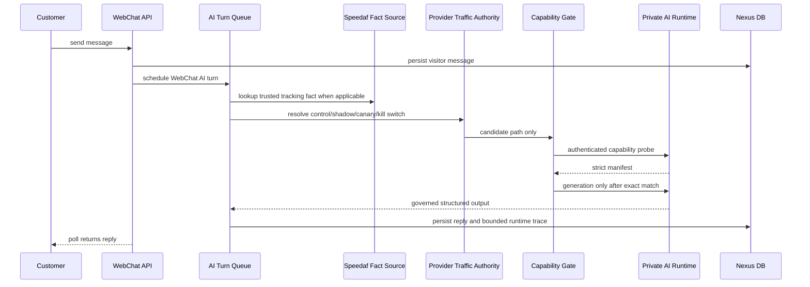

# Nexus Production Technical Manual

Last updated: 2026-07-12

This manual describes the current production direction. Retired alternate
provider bridges, old direct reply APIs, and template-fallback paths are not
part of the production runtime.

## Runtime Contract

- Customer-visible WebChat replies are generated by the unified private AI
  Runtime through Provider Runtime.
- Backend fallbacks must return no customer-visible canned text.
- Fast paths may reduce prompt size, idempotently schedule work, or record
  status, but they must not own customer wording.
- Knowledge is context for Runtime, not a backend template reply source.
- Safety gates may allow, block, repair privacy leaks, or retry malformed
  Runtime output. They must not create replacement canned replies.
- An authoritative Runtime call requires an exact authenticated
  `nexus.ai_runtime.capabilities.v1` match. A URL, token, health response or
  successful generation response alone is not readiness evidence.

## Production Runtime

The current production direction is:

- Provider: `private_ai_runtime`
- Runtime request shape: `ollama_chat`
- Generation model: `nexus-gemma4-e4b:latest`
- Generation request contract: `ollama.chat.v1`
- Customer-visible response contract: `nexus_webchat_runtime_reply_v1`
- Retrieval: independent Qdrant capability with exact embedding model,
  embedding dimension, reranker and active collection alias verified from the
  Runtime manifest
- Voice: STT, TTS and live voice represented independently from generation and
  retrieval
- Tracking fact source: `speedaf_hybrid`
- WebChat AI turn source of truth: `webchat_ai_turns`

Legacy `PRIVATE_AI_RUNTIME_DIRECT_MODEL` and
`PRIVATE_AI_RUNTIME_RAG_MODEL` are migration-only inputs. They are not
capability authority and must not identify different models. A conflicting
legacy value fails closed.

The private Runtime endpoint, exact expectations and token are configured
through deployment environment and root-managed secret files. Do not write
Runtime authorities, token values, app codes or Speedaf secrets into browser
assets, release evidence, docs, logs, tickets or committed files.

## WebChat Flow



Control, `0%` canary and kill-switch paths do not contact the Runtime.
Capability mismatch returns no customer-visible fallback text.

## Performance Profiles

- `short_general_support_v1`: greetings and very short non-logistics messages.
- `trusted_tracking_fact_v1`: live Speedaf tracking facts are already verified;
  Runtime receives compact facts and returns final reply text.
- `knowledge_direct_answer_v1`: customer-visible locked knowledge facts are
  already selected; Runtime receives compact facts and returns final reply text.
- `standard_v1`: general logistics questions that need broader context.

These profiles reduce prompt size without creating backend templates or
changing the approved generation identity.

## Speedaf Native Capability

Nexus native Speedaf integration covers the production support tool family:

- live waybill lookup
- waybill lookup by caller phone/country
- work order creation
- contact/address update request
- cancel preview and confirm
- customer-visible support knowledge retrieval

Nexus production support logic is implemented natively in this repository.
WebChat replies do not depend on any external agent runtime.

## Knowledge And Persona

Production support knowledge is maintained in Nexus `KnowledgeItem` and
`KnowledgeChunk` rows with customer/internal audience separation.

- Customer-visible items may be synchronized to the approved Runtime retrieval
  stack.
- Internal SOP/persona/tool/memory files are retained in Nexus for operator and
  runtime governance, but are not directly exposed as customer retrieval text.
- Live parcel status must always come from trusted Speedaf facts, not knowledge.
- Runtime retrieval identity does not change the Nexus PostgreSQL vector schema;
  schema changes require a separate approved Work Item and migration.

## Support Console

The current production target is a lightweight support workbench centered on:

- conversation list
- customer message timeline
- AI turn status and bounded runtime trace
- handoff state
- Speedaf controlled actions
- knowledge/customer context visible to operators
- static Runtime expectation status and privileged read-only capability probe

Ticket-heavy workflows remain out of scope unless explicitly reintroduced.

## Production Gates

Use the Provider Runtime gate before release:

```bash
PYTHONPATH=backend python -m pytest -q \
  backend/tests/test_provider_runtime_capabilities.py \
  backend/tests/test_private_ai_runtime_capability_endpoint.py \
  backend/tests/test_provider_runtime_capability_gate.py \
  backend/tests/test_provider_runtime_capability_status.py \
  backend/tests/test_provider_runtime_private_ai_runtime_adapter.py \
  backend/tests/test_provider_runtime_router.py \
  backend/tests/test_provider_runtime_traffic_selection.py \
  backend/tests/test_provider_runtime_status.py \
  backend/tests/test_webchat_runtime_ai_service.py \
  backend/tests/test_webchat_ai_turn_runtime.py \
  backend/tests/test_speedaf_client_contract.py \
  backend/tests/test_speedaf_status_map.py \
  backend/tests/test_speedaf_track_query.py
```

Before deployed verification:

1. Confirm static Admin status has exact approved expectations and no secret or
   internal authority.
2. Run the privileged read-only capability probe and require `status=ready`.
3. Run capability-gated upstream Smoke and warmup.
4. Run candidate WebChat smoke and inspect bounded `webchat_ai_turns` and
   Provider audit evidence.
5. Require exact-head CI, security review and separate release GO.

## Retired Paths

The following are retired from production and must not be reintroduced:

- Codex Direct provider
- Codex app-server bridge/runtime provider
- OpenAI Responses provider
- old direct WebChat reply API/modules
- customer-visible canned fallback replies
- static welcome bubbles
- backend template replies for customer questions
- dual generation-model authority for direct versus RAG
- unverified Runtime identity inferred from URL/token/health only
