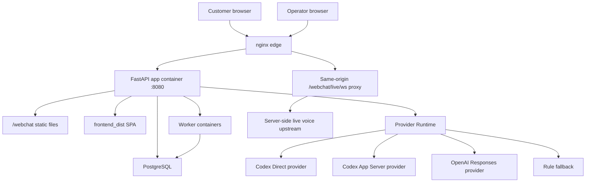
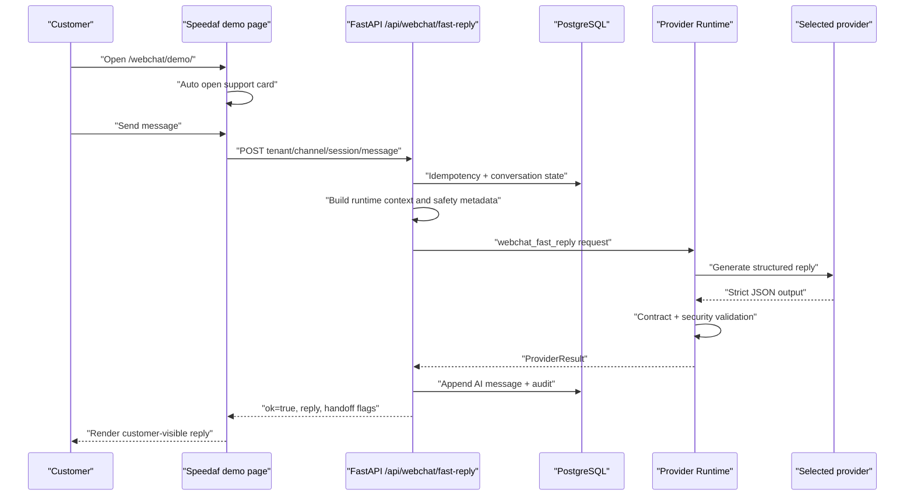
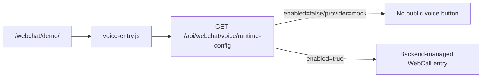
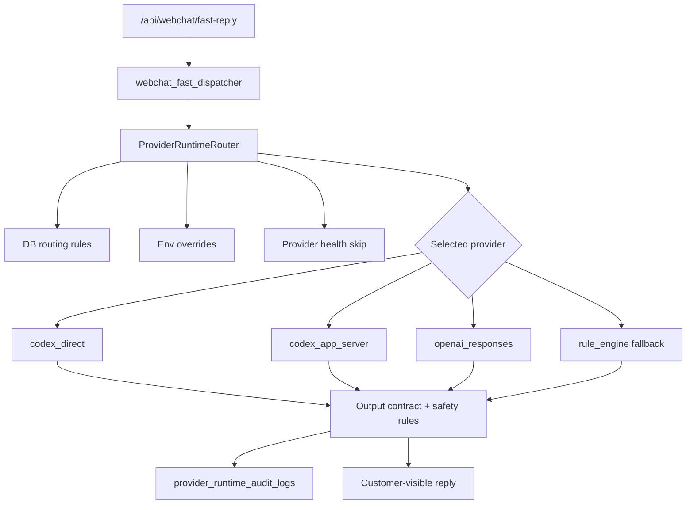
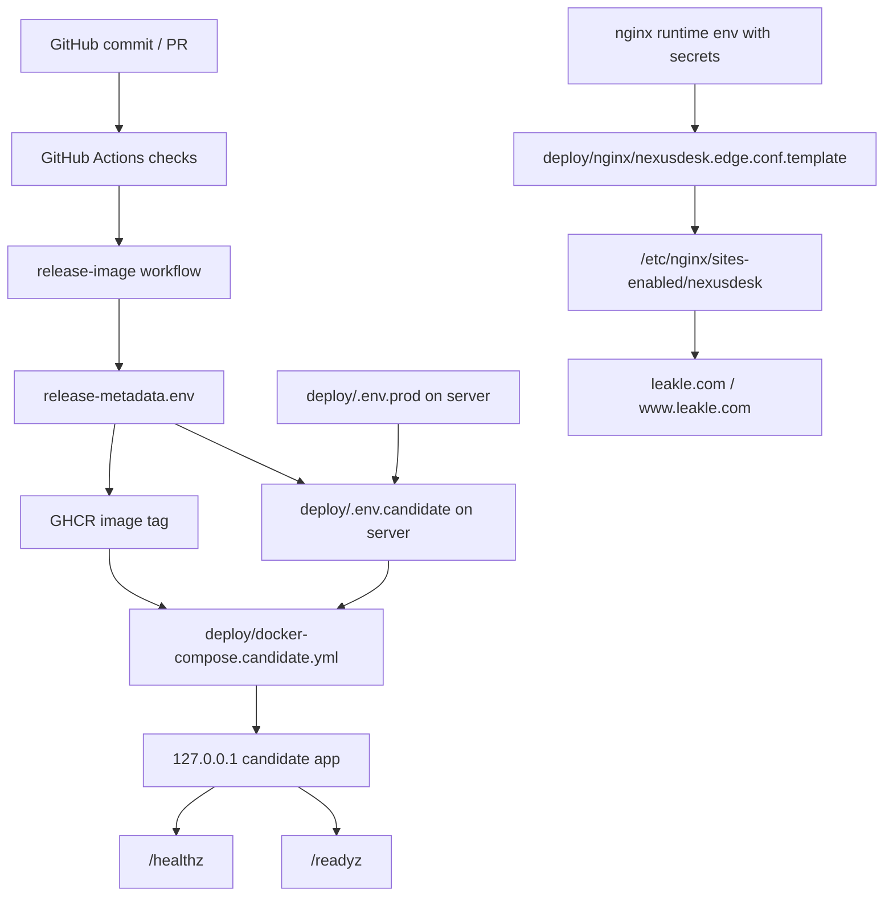

# NexusDesk 技术手册

版本日期：2026-06-30  
适用仓库：`Maximvonshaft/nexus_helpdesk`  
当前重点：去 ExternalChannel 后的纯 Nexus WebChat demo、voice-entry、Provider Runtime、候选发布与可回滚生产切换。

## 1. 阅读边界

这份手册是项目级总入口，目标是让后续工程、运维、审计可以快速理解：

- 代码在哪里。
- WebChat demo 从前端到后端如何跑通。
- 配置、CI、镜像、nginx、compose 如何串起来。
- 178.105.160.174 当前生产快照是什么。
- 去 ExternalChannel 后哪些是运行依赖，哪些只是历史兼容命名。
- 怎么发布、验证、回滚，不把服务器漂移继续扩大。

本手册不记录任何服务器密码、OAuth token、nginx Authorization、live voice 上游 token、数据库密码或 API key。真实 secret 只允许在服务器 runtime env、Docker secret、`/run/secrets` 或 secret manager 中存在。

## 2. 当前最重要结论

NexusDesk 当前默认运行时已经是 de-ExternalChannel：

- `webchat/demo` 不依赖 ExternalChannel。
- Dockerfile 不安装 `@external-channel/codex`、ExternalChannel CLI、MCP client、bridge server、sync daemon 或 event daemon。
- ExternalChannel transport、deployment、bridge、sync、event driver、CLI fallback 在生产必须保持 disabled/false。
- 新的 WebChat 快速回复通过 `provider_runtime`，当前可路由到 `codex_direct`、`codex_app_server`、`openai_responses` 或 fallback。
- `ExternalChannel*` 数据库表、schema、admin API 名称仍存在，但它们是历史数据和 UI 兼容层，不代表生产仍启动 ExternalChannel runtime。
- 178 当前公开域名 `www.leakle.com` 已经切到去 ExternalChannel 后的 candidate 镜像，并通过 WebChat demo、fast reply、voice WS smoke。

## 3. 代码结构

| 路径 | 作用 |
| --- | --- |
| `backend/app/main.py` | FastAPI app、middleware、安全头、`/healthz`、`/readyz`、路由挂载、WebChat 静态目录挂载。 |
| `backend/app/api/` | API 路由：auth、admin、tickets、webchat、webcall、provider runtime、outbound、Speedaf 等。 |
| `backend/app/services/` | 业务服务层：WebChat、Provider Runtime、知识库、工单、队列、outbound、voice、storage、observability。 |
| `backend/app/services/provider_runtime/` | Provider Runtime 控制层，负责 provider 注册、路由、canary、kill-switch、fallback、输出合同校验和审计。 |
| `backend/app/static/webchat/` | 公共 WebChat 静态资源：`widget.js`、`voice-entry.js`、demo 页面。 |
| `backend/app/static/webchat/demo/` | Speedaf showcase demo，公开入口 `/webchat/demo/`。 |
| `backend/alembic/` | 数据库迁移。 |
| `webapp/` | React + TypeScript + Vite 的运营后台 SPA。 |
| `frontend/` | 旧静态前端 fallback，不是当前主后台源。 |
| `frontend_dist/` | 构建产物，Docker build 时生成。 |
| `deploy/` | compose、nginx、systemd、server env 示例、runtime proxy 脚本。 |
| `scripts/smoke/` | 候选环境、WebChat、生产 smoke。 |
| `.github/workflows/` | CI、release image、生产 readiness、manual staging smoke。 |
| `docs/` | 架构、runbook、审计报告和本手册。 |

## 4. 技术栈

| 层 | 技术 |
| --- | --- |
| Backend | Python 3.11, FastAPI, Gunicorn, Uvicorn worker, SQLAlchemy 2, Alembic, Pydantic v2 |
| Database | PostgreSQL in production, SQLite only for local/test |
| Frontend | React 18, TypeScript, Vite, TanStack Router, TanStack Query, Radix UI, Tailwind CSS v4 |
| Realtime | WebSocket for WebChat realtime, same-origin edge WS for demo voice card |
| Voice | LiveKit-backed backend WebCall path, plus demo edge-card voice path via nginx upstream |
| AI Provider | Nexus Provider Runtime, Codex Direct, Codex App Server, OpenAI Responses, rule fallback |
| CI/CD | GitHub Actions, Docker Buildx, GHCR image |
| Runtime | Docker Compose, nginx edge proxy, `/healthz`, `/readyz`, release metadata |

## 5. 总体架构



关键原则：

- 浏览器只能访问同源 HTTP/WS 入口。
- Provider、voice upstream、support upstream 的 secret 不下发浏览器。
- Backend 是所有业务动作、权限、安全输出和审计的最终控制面。
- AI provider 只能生成受控回复或建议，不能直接写数据库、改工单或发送外部消息。

## 6. WebChat Demo 业务链路

公开入口：

- 新入口：`/webchat/demo/`
- 旧入口：`/webchat/demo.html`，meta refresh 到 `/webchat/demo/`
- Demo JS：`/webchat/demo/js/app.js?v=nexus-auto-open-chat-20260630`
- Voice JS：`/webchat/voice-entry.js?v=nexus-live-voice-card-20260629`

当前 demo 行为：

- 页面打开后客服卡片自动展开。
- 用户输入消息后，前端调用 `POST /api/webchat/fast-reply`。
- 前端只在后端返回 `ok=true` 且 `reply` 非空时展示 AI 回复。
- HTTP 错误、超时、空回复、无效 JSON 或后端错误只展示统一连接错误，不在浏览器本地编造物流状态。



核心文件：

- `backend/app/static/webchat/demo/index.html`
- `backend/app/static/webchat/demo/js/app.js`
- `backend/app/api/webchat_fast.py`
- `backend/app/services/webchat_fast_ai_service.py`
- `backend/app/services/provider_runtime/webchat_fast_dispatcher.py`
- `backend/app/services/provider_runtime/router.py`

请求 payload 最小合同：

```json
{
  "tenant_key": "default",
  "channel_key": "website",
  "session_id": "browser_session_id",
  "client_message_id": "browser_message_id",
  "body": "customer message",
  "recent_context": []
}
```

## 7. Voice Entry 链路

Demo 页面使用 runtime-gated voice entry。当前 `/api/webchat/voice/runtime-config` 为 disabled/mock 时，不应在公开 Demo 中展示 voice 控件：

```html
<script
  src="/webchat/voice-entry.js?v=nexus-runtime-gated-voice-20260702"
  data-live-voice-mode="off"
  defer>
</script>
```

链路：



约束：

- 公开 Demo 不强制 edge-card voice；未启用 runtime 时不要露出半成品入口。
- 上游 host、token、Authorization 只在 runtime env 或 secret 中。
- 麦克风必须在 HTTPS、安全上下文、正确 Permissions-Policy 下使用。
- 页面加载不应自动请求麦克风；用户点击 voice 控件后才触发。

相关文件：

- `backend/app/static/webchat/voice-entry.js`
- `backend/app/webchat_voice_config.py`
- `deploy/nginx/nexusdesk.edge.conf.template`
- `backend/tests/test_webchat_voice_mock_ui_static.py`
- `backend/tests/test_webchat_voice_static_headers.py`

常见问题：

| 现象 | 优先检查 |
| --- | --- |
| `Microphone is not available in this browser` | 是否 HTTPS、浏览器是否授权麦克风、nginx/应用是否返回 `Permissions-Policy: microphone=(self)`、是否被 iframe sandbox 阻断。 |
| `Voice disconnected` | `/webchat/live/ws` nginx upstream、Upgrade/Connection header、上游健康、CSP `connect-src`。 |
| demo voice 按钮不可见 | `/api/webchat/voice/runtime-config` 是否 `enabled=true`，以及 `voice-entry.js` 是否加载。 |

## 8. Provider Runtime

WebChat Fast Reply 的生产入口应保持：

```env
WEBCHAT_FAST_AI_PROVIDER=provider_runtime
PROVIDER_RUNTIME_ENABLED=true
PROVIDER_RUNTIME_OUTPUT_CONTRACT=speedaf_webchat_fast_reply_v1
```

Provider Runtime 负责：

- 读取 DB 中的 provider routing rule。
- 读取 env override。
- 执行 kill-switch、canary 和 fallback。
- 跳过 retired provider。
- 调用 provider adapter。
- 校验输出合同。
- 写入 `provider_runtime_audit_logs`。



当前注册 provider：

| Provider | 状态 | 说明 |
| --- | --- | --- |
| `codex_direct` | 可用但需生产隔离配置 | 通过 Codex CLI 子进程生成严格 JSON；当前 178 使用这个作为主 provider。 |
| `codex_app_server` | 可用 | 通过 bridge/runtime sidecar；默认模板里是推荐生产形态。 |
| `openai_responses` | fallback/兼容 | 需要 OpenAI API key。 |
| `rule_engine` | fallback skeleton | 用于失败时的确定性兜底路径。 |
| `external_channel_responses` | retired | Router 会移除，不允许作为回滚路径。 |

当前 178 生产快照中，主 provider 是 Codex Direct：

```env
PROVIDER_RUNTIME_PRIMARY_PROVIDER=codex_direct
EXTERNAL_CHANNEL_DEPLOYMENT_MODE=disabled
```

## 9. 去 ExternalChannel 边界

### 9.1 必须 Drop 的运行依赖

以下不再作为生产 runtime：

- `@external-channel/codex`
- ExternalChannel CLI
- ExternalChannel MCP client
- ExternalChannel bridge server
- ExternalChannel sync daemon
- ExternalChannel event daemon
- `.external_channel/media` 本地媒体读取
- `external_channel_responses` provider fallback
- ExternalChannel bridge outbound dispatch

### 9.2 必须保持 disabled 的配置

```env
EXTERNAL_CHANNEL_TRANSPORT=disabled
EXTERNAL_CHANNEL_DEPLOYMENT_MODE=disabled
EXTERNAL_CHANNEL_SYNC_ENABLED=false
EXTERNAL_CHANNEL_INBOUND_AUTO_SYNC_ENABLED=false
EXTERNAL_CHANNEL_EVENT_DRIVER_ENABLED=false
EXTERNAL_CHANNEL_BRIDGE_ENABLED=false
EXTERNAL_CHANNEL_CLI_FALLBACK_ENABLED=false
EXTERNAL_CHANNEL_BRIDGE_ALLOW_WRITES=false
```

`backend/app/settings.py` 在生产配置中会对这些值做启动校验；误打开会导致启动失败或 readiness 失败。

### 9.3 允许暂时 Keep 的兼容层

这些名称仍可能出现，但不是当前运行依赖：

- `ExternalChannelConversationLink`
- `ExternalChannelTranscriptMessage`
- `ExternalChannelAttachmentReference`
- `ExternalChannelSyncCursor`
- `ExternalChannelUnresolvedEvent`
- `/api/admin/external_channel/*` 历史 admin/readiness 端点
- operator queue 中的 unresolved work 投影
- 若干 parser/test fixture 名称
- Codex OAuth 兼容导入中的历史 ExternalChannel auth profile 命名

保留原因：

- 数据库已有历史数据。
- 前端和 admin API 合同尚未完成全量重命名迁移。
- 部分测试需要验证 retired 行为不会重新变成运行依赖。

### 9.4 已知遗留命名

`deploy/nginx/nexusdesk.edge.conf.template` 中内部 auth_request 仍可能出现 `/api/admin/external_channel/runtime-health` 这样的路径名。它是 legacy admin auth surface，不代表 ExternalChannel runtime 被启用。后续可单独做命名迁移，但不要在未迁移 DB/UI 合同前盲删。

## 10. 配置链路



配置分层：

| 层 | 文件/位置 | 说明 |
| --- | --- | --- |
| 示例配置 | `deploy/.env.prod.example` | Git 里只放模板，不放真实值。 |
| 生产稳定配置 | `/opt/nexus_helpdesk/deploy/.env.prod` | 服务器私有，存 DB、CORS、storage、provider、feature flags。 |
| 候选配置 | candidate checkout 下 `deploy/.env.candidate` | 从 `.env.prod` 复制，再追加 release metadata 和 candidate port。 |
| release metadata | GitHub Actions artifact `release-metadata.env` | 每次镜像构建生成，提供 `GIT_SHA`、`IMAGE_TAG`、`BUILD_TIME` 等。 |
| nginx 模板 | `deploy/nginx/nexusdesk.edge.conf.template` | 可进 Git，不含 secret。 |
| nginx runtime env | 服务器私有 env 文件 | 填真实 upstream、Authorization、token。 |
| Docker secret | `/run/secrets` 或 `/run/nexus/*` | provider credential key、bridge token、OAuth secret 等。 |

关键生产环境变量：

| 变量 | 生产建议 |
| --- | --- |
| `APP_ENV` | `production` |
| `DATABASE_URL` | PostgreSQL，不使用 SQLite |
| `AUTO_INIT_DB` | `false` |
| `SEED_DEMO_DATA` | `false` |
| `SECRET_KEY` | 强随机值，只在服务器 |
| `ALLOWED_ORIGINS` | 后台域名 |
| `WEBCHAT_ALLOWED_ORIGINS` | 客户站点域名 |
| `WEBCHAT_RATE_LIMIT_BACKEND` | `database` |
| `STORAGE_BACKEND` | 严格生产用 `s3`；受控 pilot 可 local 但必须备份 |
| `METRICS_ENABLED` | 可选；开启时必须配置 `METRICS_TOKEN` |
| `WEBCHAT_FAST_AI_PROVIDER` | `provider_runtime` |
| `PROVIDER_RUNTIME_KILL_SWITCH` | 紧急时可置 true |
| `PROVIDER_RUNTIME_PRIMARY_PROVIDER` | 当前 178 为 `codex_direct`；模板默认可用 `codex_app_server` |
| `CODEX_DIRECT_ENABLED` | 使用 Codex Direct 时为 true，并需隔离 HOME/CODEX_HOME |

## 11. 发布与镜像

生产发布原则：

- 优先使用 GitHub Actions 做广覆盖验证和镜像构建。
- 不在 178 服务器上手工 build 作为最终 release 证据。
- 不在运行容器内热改源码。
- 不把 `.env.prod` 里的 stale release metadata 作为版本事实。
- `/healthz` 和 `/readyz` 的 `git_sha`、`image_tag`、`frontend_build_sha` 必须和当前镜像一致。

镜像 workflow：

- 文件：`.github/workflows/release-image.yml`
- 触发：`workflow_dispatch`
- 输出：GHCR image + `release-metadata` artifact
- 默认 tag：`ghcr.io/<owner>/<repo>/helpdesk:<app_version>-<build_time>`

关键 metadata：

```env
GIT_SHA=<commit>
COMMIT_SHA=<commit>
APP_GIT_SHA=<commit>
BUILD_TIME=<yyyyMMddTHHmmssZ>
APP_BUILD_TIME=<yyyyMMddTHHmmssZ>
APP_VERSION=<prefix>-<short-sha>
IMAGE_TAG=<ghcr image tag>
FRONTEND_BUILD_SHA=<commit>
```

Dockerfile 生产约束：

- 先构建 `webapp/`，产出 `frontend_dist`。
- 构建 `tools/nexus-codex-runtime`。
- 最终 Python image 只复制必要目录，不 `COPY .`。
- 静态 WebChat 文件复制到 `/app/frontend_dist/static/webchat`。
- 非 root `appuser` 运行。
- healthcheck 使用 `http://127.0.0.1:8080/healthz`。

## 12. CI 和质量门

优先使用 GitHub Actions：

| Workflow | 作用 |
| --- | --- |
| `backend-ci.yml` | 后端编译、关键回归、生产设置合同、runtime retirement、voice、WebChat、operator queue。 |
| `frontend-ci.yml` | `typecheck`、lint、Vite build。 |
| `webchat-fast-reply-ci.yml` | WebChat Fast Reply、Provider Runtime 路由、widget/demo 静态安全扫描。 |
| `provider-runtime-gate.yml` | Provider Runtime、credential API、Alembic、router、token leakage。 |
| `production-readiness.yml` | PostgreSQL migration、严格生产 readiness config、manual smoke workflow contract。 |
| `manual-staging-smoke.yml` | 对已部署 URL 做 health/readiness/security headers/WebChat assets/CORS/可选真实后台 smoke。 |
| `release-image.yml` | 构建并推送 GHCR release image，上传 release metadata。 |

本地只推荐做小范围快速验证，例如：

```bash
PYTHONPATH=backend pytest -q backend/tests/test_webchat_voice_mock_ui_static.py
PYTHONPATH=backend pytest -q backend/tests/test_candidate_compose_contract.py
PYTHONPATH=backend pytest -q backend/tests/test_provider_runtime_status.py
cd webapp && npm run typecheck
```

广覆盖回归、构建和发布镜像优先交给 Actions。

## 13. 178.105.160.174 当前生产快照

以下是 2026-06-30 的事实快照，之后如有新部署，以服务器 `docker ps`、nginx 配置、`/healthz`、`/readyz` 为准。

| 项 | 当前值 |
| --- | --- |
| 公开域名 | `https://www.leakle.com`、`https://leakle.com` |
| 当前 nginx upstream | `http://127.0.0.1:18083` |
| 当前 candidate image | `ghcr.io/maximvonshaft/nexus_helpdesk/helpdesk:candidate-126ec570f3ef-20260630T082402Z` |
| 当前 SHA | `126ec570f3ef13936b4e58a9ed4c50e0cf96b56f` |
| 当前 app version | `candidate-126ec570f3ef` |
| Candidate compose project | `nexusdesk_candidate_99649db2` |
| Candidate container | `nexusdesk_candidate_99649db2-app-candidate-1` |
| Candidate bind | `127.0.0.1:18083->8080` |
| Provider | `codex_direct` |
| Codex Direct | `CODEX_DIRECT_ENABLED=true`，host Codex CLI 约 `0.139.0` |
| ExternalChannel mode | disabled |
| Rollback app | 旧生产容器仍在 `127.0.0.1:18081` |
| Rollback image | `nexusdesk/helpdesk:whatsapp-lite-all-direct-20260617_1829` |
| nginx pre-cutover backup | `/etc/nginx/sites-available/nexusdesk.bak.cutover-20260630T080849Z-18081` |

已验证：

- `https://www.leakle.com/healthz` 返回当前 SHA/image。
- `https://www.leakle.com/webchat/demo/` 加载 `js/app.js?v=nexus-auto-open-chat-20260630`。
- 客服卡片打开页面后自动展开。
- fast reply 返回 `ok=true`、`ai_generated=true`、`reply_source=codex_direct`。
- `wss://www.leakle.com/webchat/live/ws` 可以连接并返回 live voice connected 事件。

## 14. 候选发布流程

标准流程是旁路 candidate，再 smoke，再切 nginx。

### 14.1 构建 release image

在 GitHub Actions 触发：

```bash
gh workflow run release-image.yml \
  --ref <release-branch-or-sha> \
  -f app_version_prefix=candidate \
  -f push_image=true
```

下载 `release-metadata` artifact，作为 candidate env 的版本事实。

### 14.2 启动 candidate

在服务器新目录 checkout 对应 SHA，复制生产 env：

```bash
install -m 0600 /opt/nexus_helpdesk/deploy/.env.prod deploy/.env.candidate
cat /tmp/nexus-release-metadata/release-metadata.env >> deploy/.env.candidate
printf '\nCANDIDATE_APP_PORT=18082\nCANDIDATE_EXTERNAL_NETWORK=deploy_default\nRELEASE_CANDIDATE=true\n' >> deploy/.env.candidate
```

启动：

```bash
COMPOSE_PROJECT_NAME=nexusdesk_candidate docker compose \
  -f deploy/docker-compose.candidate.yml \
  --env-file deploy/.env.candidate \
  up -d app-candidate
```

Candidate 只绑定 `127.0.0.1`，不直接暴露公网。

### 14.3 Smoke candidate

```bash
BASE_URL=http://127.0.0.1:18082 \
EXPECTED_IMAGE_TAG="$IMAGE_TAG" \
EXPECTED_GIT_SHA="$GIT_SHA" \
REQUIRE_RELEASE_METADATA_COMPLETE=true \
scripts/smoke/production_candidate_smoke.sh
```

Release metadata 一致性 gate：

```bash
PYTHONPATH=backend python3 scripts/release_metadata_consistency_gate.py \
  --docker-image "$IMAGE_TAG" \
  --healthz-url http://127.0.0.1:18082/healthz \
  --readyz-url http://127.0.0.1:18082/readyz \
  --require-complete-metadata \
  --evidence-dir "forensics/candidate_release_metadata_$(date -u +%Y%m%dT%H%M%SZ)"
```

通过条件：

- `/healthz.status == ok`
- `/readyz.status == ready`
- release metadata complete
- `image_tag` 和 `git_sha` 匹配预期
- demo 包含 `data-live-voice-mode="off"` 且不包含 retired 静态欢迎泡泡
- `voice-entry.js` 不含生产-only 上游地址、debug marker 或 token
- CORS 允许批准 origin，拒绝 blocked origin

### 14.4 切换 nginx

先备份当前配置，再渲染模板：

```bash
cp /etc/nginx/sites-enabled/nexusdesk "/etc/nginx/sites-enabled/nexusdesk.backup.$(date -u +%Y%m%dT%H%M%SZ)"
envsubst < deploy/nginx/nexusdesk.edge.conf.template > /tmp/nexusdesk.candidate.conf
install -m 0644 /tmp/nexusdesk.candidate.conf /etc/nginx/sites-enabled/nexusdesk
nginx -t
systemctl reload nginx
```

切换后马上验证：

```bash
curl -fsS http://127.0.0.1/healthz
curl -fsS http://127.0.0.1/readyz
BASE_URL=http://127.0.0.1 scripts/smoke/production_candidate_smoke.sh
```

## 15. 回滚

触发条件：

- candidate smoke 失败。
- nginx `nginx -t` 失败。
- `/readyz` 非 ready。
- 用户可见 WebChat、voice、后台登录、静态资源出现回归。
- 错误率或日志异常明显上升。

回滚 nginx 到最近备份：

```bash
latest_backup="$(ls -1t /etc/nginx/sites-enabled/nexusdesk.backup.* | head -n 1)"
install -m 0644 "$latest_backup" /etc/nginx/sites-enabled/nexusdesk
nginx -t
systemctl reload nginx
curl -fsS http://127.0.0.1/healthz
curl -fsS http://127.0.0.1/readyz
```

Candidate 可保留用于排查，也可下线：

```bash
COMPOSE_PROJECT_NAME=nexusdesk_candidate docker compose \
  -f deploy/docker-compose.candidate.yml \
  --env-file deploy/.env.candidate \
  down
```

## 16. Health、Readiness 和 Release Metadata

`/healthz` 返回：

- `status`
- `env`
- `app_version`
- `git_sha`
- `image_tag`
- `build_time`
- `frontend_build_sha`
- `release_metadata_complete`
- `release_metadata_missing`

`/readyz` 额外返回：

- `database`
- `migration_revision`
- `storage`
- `frontend`

`release_metadata_complete=false` 不应进入生产切换。

相关文件：

- `backend/app/services/release_metadata.py`
- `scripts/export_release_metadata.sh`
- `scripts/release_metadata_consistency_gate.py`
- `docs/deployment/release-metadata.md`
- `docs/runbooks/release-metadata-consistency-gate.md`

## 17. 数据库和迁移

生产数据库应为 PostgreSQL。SQLite 只用于本地开发和 CI 局部测试。

迁移命令：

```bash
cd backend
alembic upgrade head
alembic current
```

生产 readiness 要求：

- DB 可连接。
- Alembic revision 非空。
- app 和 worker 指向同一数据库。
- candidate 可加入生产 runtime network，但 app port 只绑定 localhost。

## 18. Worker 和队列

标准 compose worker：

| Service | Queue |
| --- | --- |
| `worker-outbound` | `outbound` |
| `worker-background` | `background` |
| `worker-webchat-ai` | `webchat-ai` |
| `worker-handoff-snapshot` | `handoff-snapshot` |

`legacy-worker` profile 只用于受控兼容场景，不是默认生产路径。

Outbound 语义：

- API accepted 不等于外部送达。
- WebChat 本地回复不等于 WhatsApp/Email/SMS 外部发送。
- 外部发送最终状态以 `ticket_outbound_messages`、worker 日志和 provider 状态为准。

常用 SQL：

```sql
select id, ticket_id, channel, status, provider_status, failure_code, failure_reason, sent_at
from ticket_outbound_messages
order by id desc
limit 50;
```

## 19. 安全边界

生产安全硬约束：

- 禁止提交真实 `.env.prod`、`.env.candidate`、token、私钥、数据库密码。
- nginx 模板不放 token-bearing URL。
- `/metrics` 若开启，必须 token 保护，并配合网络访问控制。
- `ALLOW_DEV_AUTH=false`。
- `WEBCHAT_ALLOW_LEGACY_TOKEN_TRANSPORT=false`。
- WebChat CORS 必须限定真实客户站点。
- AI 输出必须经过 strict parser、output contract、安全词和业务事实边界校验。
- Codex Direct 必须使用隔离 HOME/CODEX_HOME，不让 provider 子进程继承业务 secret。
- 生产录音相关配置默认关闭，除非完成同意策略和合规审查。

## 20. 常见排障

### 20.1 WebChat demo 没自动展开

检查：

```bash
curl -fsS https://www.leakle.com/webchat/demo/ | grep 'nexus-auto-open-chat'
curl -fsS https://www.leakle.com/webchat/demo/js/app.js | grep 'openChat();'
```

若静态缓存旧版本，更新 `index.html` 中 `js/app.js?v=...` cache key 并重新发布镜像。

### 20.2 Fast Reply 超时或无 AI 回复

检查：

- `/healthz` 当前 SHA/image 是否正确。
- `/readyz` 是否 ready。
- `WEBCHAT_FAST_AI_PROVIDER=provider_runtime`。
- `PROVIDER_RUNTIME_PRIMARY_PROVIDER` 是否为预期。
- provider runtime audit 是否有 `timeout`、`parse_reject`、`all_providers_failed`。
- Codex Direct 时检查 `CODEX_DIRECT_ENABLED`、`CODEX_DIRECT_COMMAND`、auth 文件、timeout。

### 20.3 Voice disconnected

检查：

- `GET /webchat/voice-entry.js` 是否为当前版本。
- nginx `/webchat/live/ws` 是否带 Upgrade/Connection。
- 上游 live voice health。
- 浏览器 Network 中 WS close code。
- CSP `connect-src` 是否允许同源 WS。

### 20.4 `/readyz` 失败

优先看：

- database connection。
- Alembic revision。
- storage readiness。
- frontend build presence。
- 容器 env 是否有 stale release metadata。

### 20.5 ExternalChannel 字符串仍出现

先分类：

- 若是 DB model/schema/admin API/test fixture：多半是兼容命名。
- 若是 env 被打开：必须修复为 disabled/false。
- 若是 Dockerfile/npm/package 安装 `@external-channel/*`：这是回归，必须阻断。
- 若是 provider fallback 出现 `external_channel_responses`：这是回归，必须阻断。

## 21. 相关文档索引

| 文档 | 用途 |
| --- | --- |
| `README.md` | 项目概要和去 ExternalChannel 状态。 |
| `docs/deployment/runtime-topology.md` | 标准 runtime topology。 |
| `docs/deployment/release-metadata.md` | release metadata 生成和验证。 |
| `docs/runbooks/production-candidate-cutover-178.md` | 178 candidate 切换和回滚。 |
| `docs/runbooks/release-metadata-consistency-gate.md` | image 与 health/readiness 一致性 gate。 |
| `docs/ops/production-drift-reconciliation-20260629.md` | 178 漂移治理 Keep/Rewrite/Drop。 |
| `docs/architecture/WEBCHAT_AI_PROVIDER_ROUTER.md` | WebChat AI provider router。 |
| `docs/architecture/NEXUS_PROVIDER_RUNTIME_CODEX.md` | Codex provider runtime 集成。 |
| `docs/webchat-fast-reply-validation-runbook.md` | WebChat Fast Reply 验证。 |
| `docs/webchat-voice-runtime.md` | WebChat voice runtime。 |
| `docs/ops/alerting.md` | 基础告警和排障入口。 |
| `docs/ops/release-governance.md` | release governance 和证据清单。 |

## 22. 后续建议

按当前事实，下一阶段建议：

1. 把 178 当前 candidate 形态固化为正式生产 compose/project 名称，减少长期双源码/双容器混淆。
2. 将 nginx 中遗留的 ExternalChannel 命名 auth path 做一次兼容迁移设计，不急删。
3. 把 Codex Direct 的生产隔离策略文档化并加 CI/static gate，确保 provider 子进程不继承业务 secret。
4. 用 GitHub Actions 的 `manual-staging-smoke.yml` 补一套公开域名 smoke 证据，替代临时本地脚本记录。
5. 对 WebChat demo、voice-entry、fast reply 增加 Playwright 公开域名 smoke，覆盖自动展开、发送消息、WS 连接。
6. 清理历史 ExternalChannel 兼容层时按 DB migration、API contract、frontend contract 分阶段做，不做一次性大删除。
