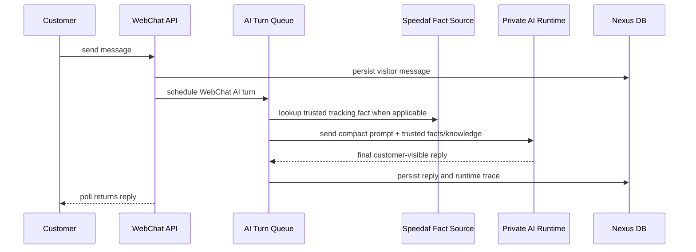

# Nexus Production Technical Manual

Last updated: 2026-07-05

This manual describes the current production direction. Retired alternate
provider bridges, old direct reply APIs, and template-fallback paths are not
part of the production runtime.

## Runtime Contract

- Customer-visible WebChat replies are generated by the unified private AI
  Runtime through Provider Runtime.
- Backend fallbacks must return no customer-visible canned text.
- Fast paths may reduce prompt size, idempotently schedule work, or record
  status, but they must not own customer wording.
- Knowledge is context for Runtime, not a backend template reply source.
- Safety gates may allow, block, repair privacy leaks, or retry malformed
  Runtime output. They must not create replacement canned replies.

## Production Runtime

Current 178 candidate deployment uses:

- Provider: `private_ai_runtime`
- Runtime request shape: `ollama_chat`
- Direct model: `qwen2.5:3b`
- Complex/RAG model configured at Runtime side: `qwen3:4b`
- Production guard: heavier RAG models must use an isolated Runtime origin when
  `PRIVATE_AI_RUNTIME_CHAT_MODE=rag|auto`; shared low-latency WebChat Runtime
  is rejected unless explicitly allowed after benchmarking.
- Tracking fact source: `speedaf_hybrid`
- WebChat AI turn source of truth: `webchat_ai_turns`

The private Runtime endpoint and token are configured through deployment
environment and secret files. Do not write token values, app codes, or Speedaf
secrets into docs, logs, tickets, or committed files.

## WebChat Flow



## Performance Profiles

- `short_general_support_v1`: greetings and very short non-logistics messages.
- `trusted_tracking_fact_v1`: live Speedaf tracking facts are already verified;
  Runtime receives compact facts and returns final reply text.
- `knowledge_direct_answer_v1`: customer-visible locked knowledge facts are
  already selected; Runtime receives compact facts and returns final reply text.
- `standard_v1`: general logistics questions that need broader context.

These profiles reduce prompt size without creating backend templates.

## Speedaf Native Capability

Nexus native Speedaf integration covers the production support tool family:

- live waybill lookup
- waybill lookup by caller phone/country
- work order creation
- contact/address update request
- cancel preview and confirm
- customer-visible support knowledge retrieval

Nexus production support logic is implemented natively in this repository. WebChat replies do not depend on any external agent runtime.

## Knowledge And Persona

Production support knowledge is maintained in Nexus `KnowledgeItem` and
`KnowledgeChunk` rows with customer/internal audience separation.

- Customer-visible items are synced to AI Runtime RAG.
- Internal SOP/persona/tool/memory files are retained in Nexus for operator and
  runtime governance, but are not directly exposed as customer RAG text.
- Live parcel status must always come from trusted Speedaf facts, not knowledge.

## Support Console

The current production target is a lightweight support workbench centered on:

- conversation list
- customer message timeline
- AI turn status and runtime trace
- handoff state
- Speedaf controlled actions
- knowledge/customer context visible to operators

Ticket-heavy workflows remain out of scope unless explicitly reintroduced.

## Production Gates

Use focused gates before release:

```bash
cd backend
python -m pytest tests/test_provider_runtime_private_ai_runtime_adapter.py \
  tests/test_webchat_runtime_ai_service.py \
  tests/test_webchat_ai_turn_runtime.py \
  tests/test_webchat_rate_limit_bucket.py \
  tests/test_speedaf_client_contract.py \
  tests/test_speedaf_status_map.py \
  tests/test_speedaf_track_query.py \
  -q
```

For deployed verification, use public WebChat smoke against
`https://www.leakle.com/webchat/demo/` and inspect the matching
`webchat_ai_turns.runtime_trace_json`.

## Retired Paths

The following are retired from production and must not be reintroduced:

- Codex Direct provider
- Codex app-server bridge/runtime provider
- OpenAI Responses provider
- old direct WebChat reply API/modules
- customer-visible canned fallback replies
- static welcome bubbles
- backend template replies for customer questions
