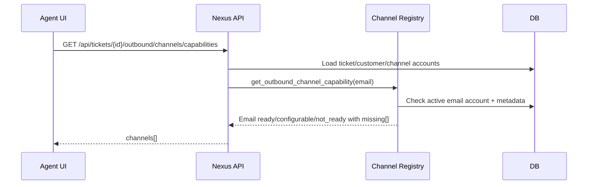
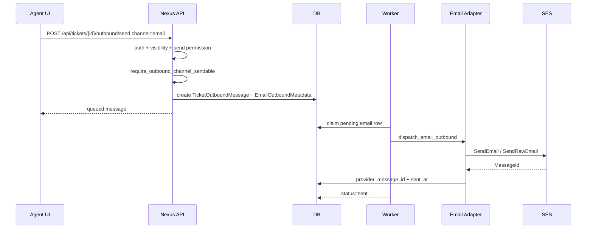
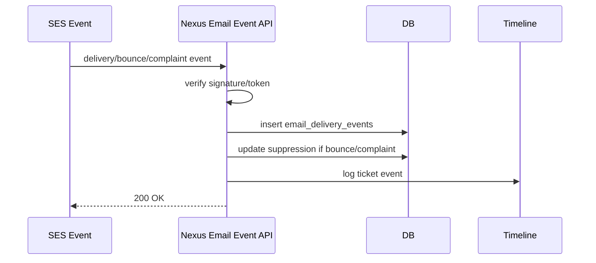
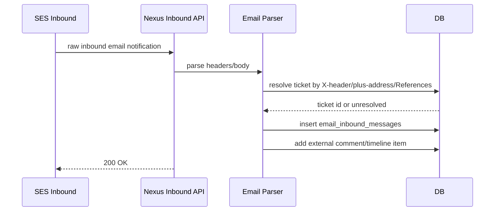

# Sequence Flows

## Flow 1 — Capability check

```mermaid
sequenceDiagram
  participant UI as Agent UI
  participant API as Nexus API
  participant REG as Channel Registry
  participant DB as DB

  UI->>API: GET /api/tickets/{id}/outbound/channels/capabilities
  API->>DB: Load ticket/customer/channel accounts
  API->>REG: get_outbound_channel_capability(email)
  REG->>DB: Check active email account + metadata
  REG-->>API: Email ready/configurable/not_ready with missing[]
  API-->>UI: channels[]
```

## Flow 2 — Email send

```mermaid
sequenceDiagram
  participant UI as Agent UI
  participant API as Nexus API
  participant DB as DB
  participant W as Worker
  participant EA as Email Adapter
  participant SES as SES

  UI->>API: POST /api/tickets/{id}/outbound/send channel=email
  API->>API: auth + visibility + send permission
  API->>API: require_outbound_channel_sendable
  API->>DB: create TicketOutboundMessage + EmailOutboundMetadata
  API-->>UI: queued message
  W->>DB: claim pending email row
  W->>EA: dispatch_email_outbound
  EA->>SES: SendEmail / SendRawEmail
  SES-->>EA: MessageId
  EA->>DB: provider_message_id + sent_at
  W-->>DB: status=sent
```

## Flow 3 — Bounce/complaint

```mermaid
sequenceDiagram
  participant SES as SES Event
  participant API as Nexus Email Event API
  participant DB as DB
  participant TL as Timeline

  SES->>API: delivery/bounce/complaint event
  API->>API: verify signature/token
  API->>DB: insert email_delivery_events
  API->>DB: update suppression if bounce/complaint
  API->>TL: log ticket event
  API-->>SES: 200 OK
```

## Flow 4 — Inbound reply

```mermaid
sequenceDiagram
  participant SES as SES Inbound
  participant API as Nexus Inbound API
  participant Parser as Email Parser
  participant DB as DB

  SES->>API: raw inbound email notification
  API->>Parser: parse headers/body
  Parser->>DB: resolve ticket by X-header/plus-address/References
  DB-->>Parser: ticket id or unresolved
  Parser->>DB: insert email_inbound_messages
  Parser->>DB: add external comment/timeline item
  API-->>SES: 200 OK
```
