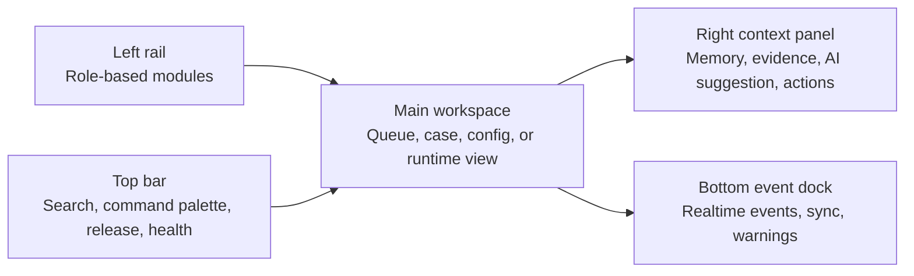
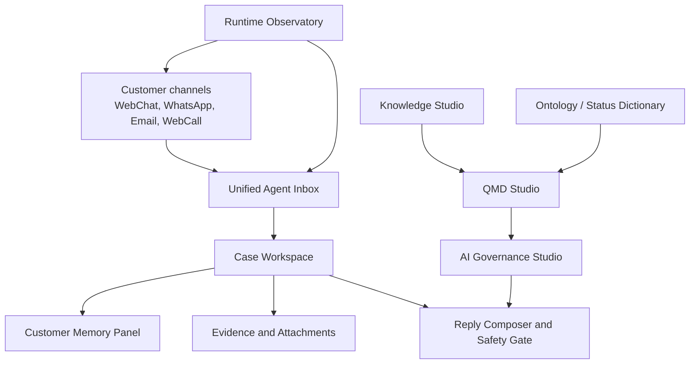

# 21 - Speedy Console Inspired Frontend Redesign RFC

## Status

Proposed. This is a planning artifact only. It does not change runtime behavior, deploy assets, or add backend migrations.

## Purpose

This RFC turns the read-only Speedy Console and NexusDesk audit into an implementation target for the next frontend redesign phase.

The target is not a visual reskin and not a rewrite of the current React app. NexusDesk should become a unified customer operations console that helps an agent handle a customer case, an AI operator govern answer quality, and an ops user observe channel/runtime health from one consistent product system.

## Source baseline

### NexusDesk frontend facts

- The admin console is a Vite React app under `webapp/`.
- Runtime React is `18.3.1`; `@types/react` remains on the `19.x` line.
- Routing uses TanStack Router and currently covers workbench, workspace, WebChat, Email, WebCall, provider credentials, bulletins, AI Control, Knowledge Studio, Persona Builder, Control Tower, QA Training, accounts, outbound email, users, security, runtime, and control-plane views.
- `AppShell` already has role-filtered navigation, command palette, runtime health, queue summary, auto-refresh, and direct route denial.
- `WebchatInboxV5Page` already has live handoff views, realtime events, fallback refresh, safety review, manual reply, attachment upload, escalation, and WebCall context.
- `Knowledge Studio` already has upload, parse, draft, publish, retrieval test, conflict scan, and golden test flows.
- `Persona Builder` already has profile resolution, runtime evidence, approval, publish, and review queue flows.
- `AI Control` already has persona, knowledge, SOP/policy rules, retrieval test, publish, disable, and rollback flows.
- `webapp/src/styles/tokens.css` contains semantic token work but is not imported yet; active styling remains centralized in `webapp/src/styles.css`.

### Speedy Console facts from the 178 read-only audit

- Speedy Console is served as a standalone PWA at `/speedy-console/`, with portrait-first mobile assumptions.
- The observed product loop is WhatsApp conversation list, conversation detail, state action, reply send, support memory/config, quality regression, and service status.
- The observed conversation actions include `claim`, `release`, `resolve`, and `reply_sent`.
- The observed support intelligence concepts include memory config, status dictionary, customer scoped knowledge, draft/shadow release, validator gates, smoke gates, MCP/tool probes, runtime collection export, reindex, and retrieval scope checks.
- The observed QMD-related signals are query/index failures, reindex repair, retrieval scope validation, and customer KB scope filtering.
- The observed Speedy implementation contains server-specific drift and legacy runtime coupling. NexusDesk should reuse product patterns and data semantics, not copy the legacy runtime, branding, hard-coded filters, or opaque static bundle behavior.

## Product objective

Redesign NexusDesk around three operating loops:

1. **Handle** - agents resolve customer conversations and tickets from one inbox/workspace.
2. **Govern** - AI, knowledge, QMD, ontology, persona, SOP, and policy changes are reviewed, tested, and published through controlled release gates.
3. **Observe** - operators see channel readiness, runtime health, release identity, and rollback/smoke status without reading logs first.

## Target information architecture

```text
Operations
  Today
  Unified Agent Inbox
  Case Workspace
  Control Tower
  QA / Training

Channels
  WebChat
  WhatsApp
  Email
  WebCall
  Channel Accounts

Knowledge
  Knowledge Studio
  QMD Studio
  Ontology / Status Dictionary
  Knowledge Gaps

AI Governance
  Persona Builder
  AI Rules
  Memory Config
  Simulation / Golden Tests

Runtime
  Runtime Observatory
  Provider Credentials
  Release Metadata
  Smoke / Rollback

Admin
  Users
  Security
  Control Plane
```

## Target shell

The current `AppShell` should evolve into a denser operations shell with stable zones:



Required behavior:

- Keep command palette and role-based navigation.
- Add a route-aware right context panel for customer memory, evidence, AI reasoning, or release state.
- Add an event dock for realtime channel/runtime warnings.
- Support compact and comfortable density.
- Keep mobile/tablet usable; Speedy Console proves that mobile operator flows matter.

## Module targets

### 1. Unified Agent Inbox

Merge the mental model of WebChat Inbox and Speedy WhatsApp handoff:

- Views: requested, mine, AI active, waiting, unread, closed.
- Channel badges: WebChat, WhatsApp, Email, WebCall.
- State actions: claim, release, resolve, reply sent, reopen, escalate.
- Safety states: safe, needs review, blocked, unsupported fact, sensitive content.
- Agent can select a conversation without losing queue position.
- Realtime event failures degrade to visible fallback refresh.

### 2. Case Workspace

The Workspace should become the case handling cockpit:

- Left: prioritized queue, SLA, unread, assigned owner, channel.
- Center: customer conversation, ticket facts, attachments, shipment/order evidence.
- Right: customer memory, AI recommendation, safety gate, next action.
- Bottom: audit/event stream for selected case.

The agent should be able to handle one case without switching pages.

### 3. Customer Memory

Borrow the support-agent memory pattern, but make it auditable in NexusDesk:

- Store and display customer facts, recent issue summary, preferences, risk flags, and unresolved commitments.
- Every memory item must show source, timestamp, confidence, scope, and review state.
- Separate verified memory from AI-suggested memory.
- Let the agent accept, reject, or correct suggested memory.
- Never expose memory internals in the customer-facing widget.

### 4. WhatsApp Channel Admin

Bring the channel lifecycle into NexusDesk, using the native NexusDesk WhatsApp sidecar:

- Account list with connection, QR status, last heartbeat, send readiness, and delivery health.
- QR binding panel with generated time, expiry state, retry guidance, and consumed/connected status.
- Session reset must be permission-gated and confirmed.
- Channel smoke should prove inbound, outbound, status callback, and no-secret logging.
- This must not depend on the legacy Speedy runtime path.

### 5. Knowledge + QMD Studio

Keep current Knowledge Studio and add QMD as the retrieval quality cockpit.

In this RFC, QMD means **Query and Memory Diagnostics**. It is not a separate AI model. It is the operator-facing layer for checking retrieval, index, memory, scope, and answer-grounding health.

QMD should expose:

- Query replay against published knowledge.
- Scope filter explanation: market, channel, audience, language, customer whitelist, TTL.
- Index status: published version, indexed version, chunk count, last reindex, failure reason.
- Shadow release comparison: current vs candidate retrieval results.
- Golden test history and validator gate results.
- Failure dictionary including query failure, reindex failure, scope miss, stale index, no grounded answer.

### 6. Ontology / Status Dictionary

Add a first-class controlled vocabulary module:

- Case intent taxonomy.
- Shipment/order status dictionary.
- Channel status dictionary.
- Action taxonomy: refund, resend, investigate, handoff, resolve, escalate.
- Safety reason taxonomy.
- Memory fact taxonomy.

Ontology should power labels, filters, AI prompt context, QA analytics, and reporting. It should not be hidden as ad hoc strings in route components.

### 7. AI Governance Studio

Unify Persona Builder and AI Control into an operator-friendly governance workflow:

- Persona, SOP, policy, memory config, and answer style are edited through business forms first.
- JSON mode remains available for advanced users.
- Draft, review, approve, shadow, publish, rollback are explicit states.
- Runtime evidence must show selected persona, selected knowledge, governing rules, and blocked reasons.
- Simulation and golden tests should be launchable before publish.

### 8. Runtime Observatory

Runtime should become a release and channel control room:

- `/healthz` and `/readyz` release metadata.
- Provider runtime status.
- Queue/dead job status.
- WhatsApp sidecar status.
- WebChat realtime status.
- Email/WebCall health.
- Candidate smoke results.
- Rollback runbook links and last known-good release identity.

### 9. WebChat Demo and Widget Lab

Keep the public WebChat demo functional while redesigning the admin console:

- Demo remains a customer-facing validation surface, not the admin cockpit.
- Widget settings should move into a lab/config page with theme, locale, welcome text, allowed origin, snippet, and mobile preview.
- Demo smoke should remain in GitHub Actions and must not require production credentials.

## Keep / Rewrite / Drop from Speedy Console

| Decision | Items |
| --- | --- |
| Keep | WhatsApp handoff state model, mobile-first support loop, memory config concept, status dictionary, QMD/reindex diagnostics, draft/shadow/publish gates, service status overview |
| Rewrite | UI in NexusDesk React/Radix/TanStack patterns, API contracts through NexusDesk backend, QR binding through native sidecar, memory as auditable NexusDesk records, QMD as first-class route |
| Drop | Legacy runtime branding, hard-coded customer filters, static-bundle-only configuration, opaque support endpoints, secrets in browser-visible URLs, raw JSON as the primary business UI |

## Frontend architecture target



Implementation shape:

- Split route modules into feature folders before adding large new UI.
- Keep request infrastructure centralized, but move typed feature clients into domain modules.
- Convert repeated card, table, badge, empty, error, dialog, sheet, and status patterns into shared primitives.
- Import semantic tokens through a reviewed design-system migration instead of growing `styles.css`.
- Use fixed panel dimensions, responsive split panes, and stable skeletons to prevent layout jumps.

## Design direction

- Style: compact enterprise operations console.
- Palette: neutral operational base with clear channel/status colors; avoid one-hue decorative themes.
- Radius: prefer `8px` for dense panels and controls unless an existing component requires a larger radius.
- Typography: keep system/Inter style, no viewport-scaled font sizes, no negative letter spacing.
- Icons: use a consistent SVG icon set for controls; do not use emojis as UI icons.
- Motion: only for orientation and state changes, with `prefers-reduced-motion` support.
- Accessibility: visible focus, semantic buttons, no color-only status, 44px touch targets where mobile use is expected.

## Required contracts before implementation

| Contract | Needed by |
| --- | --- |
| Conversation state contract | Unified Agent Inbox and WhatsApp/WebChat state actions |
| Channel account readiness contract | WhatsApp QR/admin and Runtime Observatory |
| Customer memory contract | Case Workspace, AI Governance, QA |
| QMD run/result contract | Knowledge + QMD Studio |
| Ontology dictionary contract | Inbox filters, case labels, AI prompts, analytics |
| Release gate contract | Runtime Observatory and publish workflows |
| Safety review contract | Reply composer, AI suggestions, audit |

## GitHub-first execution plan

1. Add this RFC and review it as the design gate.
2. Create a frontend foundation PR that only introduces shell/component/tokens structure, with no product behavior changes.
3. Add mocked Playwright coverage for 375px, 768px, 1024px, and 1440px viewport smoke.
4. Add route and API contract tests for the new module boundaries.
5. Use GitHub Actions for build, typecheck, lint, webapp tests, e2e smoke, size report, and secret scan.
6. Only after green CI, implement one module at a time: Inbox, Workspace, Memory, QMD/Ontology, Channel Admin, Runtime.

## Acceptance criteria

- An agent can claim, handle, reply to, resolve, and audit a customer conversation from one cockpit.
- The same cockpit can show WebChat and WhatsApp conversations without changing the agent mental model.
- AI suggestions always show evidence, memory usage, governing rule, and safety state.
- QMD can explain why a query did or did not retrieve usable knowledge.
- Ontology/status dictionary controls labels and filters instead of scattered string literals.
- WhatsApp QR binding is visible and permission-gated in NexusDesk.
- WebChat demo and widget behavior remain intact.
- No legacy Speedy runtime dependency or branding is introduced into NexusDesk.
- The redesign is validated through GitHub Actions before merge.
