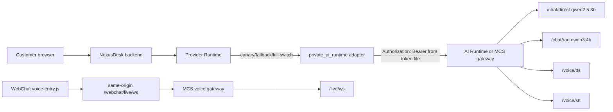

# Private AI Runtime Rollout Runbook

This runbook wires NexusDesk to a server-side AI Runtime without exposing the runtime token to customer browsers or `widget.js`.

## Target Scope



## Server Secrets

Create a root-owned token file on the server. Do not put the token in `deploy/.env.prod`, nginx config, `widget.js`, or browser-visible HTML.

```bash
install -d -m 0700 /run/secrets
printf '%s' "$AI_RUNTIME_TOKEN" > /run/secrets/ai_runtime_token
chmod 0400 /run/secrets/ai_runtime_token
unset AI_RUNTIME_TOKEN
```

Rotate the token before production cutover if it has been shared in chat, logs, screenshots, or shell history.

## Candidate Env

Use these values in the candidate env first. Replace the base URL with the approved MCS gateway when it is available; direct public-IP access is acceptable only as a temporary server-to-server bridge.

```env
WEBCHAT_FAST_AI_PROVIDER=provider_runtime
WEBCHAT_FAST_AI_FALLBACK_PROVIDER=rule_engine

PRIVATE_AI_RUNTIME_ENABLED=true
PRIVATE_AI_RUNTIME_BASE_URL=http://47.87.143.41:18081
PRIVATE_AI_RUNTIME_TOKEN_FILE=/run/secrets/ai_runtime_token
PRIVATE_AI_RUNTIME_DIRECT_PATH=/chat/direct
PRIVATE_AI_RUNTIME_RAG_PATH=/chat/rag
PRIVATE_AI_RUNTIME_CHAT_MODE=direct
PRIVATE_AI_RUNTIME_REQUEST_SHAPE=question
PRIVATE_AI_RUNTIME_DIRECT_MODEL=qwen2.5:3b
PRIVATE_AI_RUNTIME_RAG_MODEL=qwen3:4b

PROVIDER_RUNTIME_PRIMARY_PROVIDER=private_ai_runtime
PROVIDER_RUNTIME_FALLBACK_PROVIDERS=openai_responses,rule_engine
PROVIDER_RUNTIME_OUTPUT_CONTRACT=speedaf_webchat_fast_reply_v1
PROVIDER_RUNTIME_TIMEOUT_MS=10000
PROVIDER_RUNTIME_CANARY_PERCENT=0
PROVIDER_RUNTIME_KILL_SWITCH=false
```

For WebCall AI production providers:

```env
WEBCALL_AI_PRODUCTION_ENABLED=true
WEBCALL_AI_AGENT_ENABLED=true
WEBCALL_AI_PUBLIC_ROLLOUT_MODE=internal
WEBCALL_AI_PROVIDER_PROFILE=external
STT_PROVIDER=external
LLM_PROVIDER=external
TTS_PROVIDER=external
STT_ENDPOINT=http://47.87.143.41:18081/voice/stt
LLM_ENDPOINT=http://47.87.143.41:18081/chat/direct
TTS_ENDPOINT=http://47.87.143.41:18081/voice/tts
STT_API_KEY_FILE=/run/secrets/ai_runtime_token
LLM_API_KEY_FILE=/run/secrets/ai_runtime_token
TTS_API_KEY_FILE=/run/secrets/ai_runtime_token
TTS_VOICE=af_heart
```

For Knowledge Runtime, only enable OpenAI-compatible embeddings after confirming the runtime exposes `/v1/embeddings` and the vector dimension:

```env
KNOWLEDGE_RUNTIME_VERSION=v2
KNOWLEDGE_EMBEDDINGS_ENABLED=true
KNOWLEDGE_EMBEDDING_PROVIDER=openai_compatible
KNOWLEDGE_EMBEDDING_BASE_URL=http://47.87.143.41:18081/v1
KNOWLEDGE_EMBEDDING_API_KEY_FILE=/run/secrets/ai_runtime_token
KNOWLEDGE_EMBEDDING_MODEL=BAAI/bge-m3
KNOWLEDGE_EMBEDDING_DIM=<confirmed_dimension>
KNOWLEDGE_VECTOR_FALLBACK_ALLOWED=false
```

If the runtime only supports `/rag/search` and `/rag/upsert`, keep `KNOWLEDGE_EMBEDDINGS_ENABLED` on the existing Nexus pgvector path and route answer generation through `PRIVATE_AI_RUNTIME_CHAT_MODE=rag` or `auto`.

## Smoke

Run the upstream smoke from the app image or backend workspace:

```bash
python backend/scripts/smoke_private_ai_runtime.py \
  --base-url http://47.87.143.41:18081 \
  --token-file /run/secrets/ai_runtime_token \
  --request-shape question \
  --include-rag \
  --include-live-health \
  --include-tts
```

Then run candidate WebChat smoke against the candidate app port. The provider audit rows must show `provider=private_ai_runtime`, `status=ok`, no secret values, and parse rejects must fall back cleanly.

## Cutover

1. Start candidate with `PROVIDER_RUNTIME_CANARY_PERCENT=0`.
2. Pass smoke and inspect `provider_runtime_audit_logs`.
3. Raise canary to `1`, then `5`, then `25`, then `100`.
4. Keep `PROVIDER_RUNTIME_FALLBACK_PROVIDERS=openai_responses,rule_engine`.
5. Roll back instantly with:

```env
PROVIDER_RUNTIME_KILL_SWITCH=true
```

or:

```env
PROVIDER_RUNTIME_PRIMARY_PROVIDER=openai_responses
PROVIDER_RUNTIME_FALLBACK_PROVIDERS=rule_engine
```

## Production Gates

- Token is present only in a server-side file.
- Browser network traces do not contain `47.87.143.41`, bearer tokens, or upstream WS query tokens.
- WebChat Fast Reply returns valid `speedaf_webchat_fast_reply_v1` output.
- Live tracking status is never claimed without trusted tracking evidence.
- WebCall voice remains same-origin through `/webchat/live/ws`.
- RAG embedding dimension is confirmed before writing production vectors.
