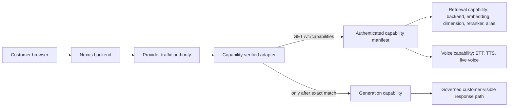

# Private AI Runtime Rollout Runbook

This runbook connects Nexus OSR to a server-side Private AI Runtime without exposing the Runtime origin, bearer token, manifest body or upstream response to customer browsers or release artifacts.

The Runtime is **not ready because a URL and token exist**. Every candidate call is gated by the exact authenticated capability contract `nexus.ai_runtime.capabilities.v1`.

## Target boundary



Generation, retrieval and voice are independent capability families. Retrieval is not represented as a second generation model.

## Server-to-server trust

Create one root-managed token file for Nexus and one corresponding token file for the Runtime endpoint. Do not put the token in Git, environment templates, nginx configuration, browser assets, screenshots, chat messages, shell history or release evidence.

```bash
install -d -m 0750 -o root -g <nexus-runtime-group-id> <runtime-secrets-directory>
printf '%s' "$AI_RUNTIME_TOKEN" > <runtime-secrets-directory>/ai_runtime_token
chown <nexus-runtime-user-id>:<nexus-runtime-group-id> <runtime-secrets-directory>/ai_runtime_token
chmod 0400 <runtime-secrets-directory>/ai_runtime_token
unset AI_RUNTIME_TOKEN
```

The application mounts the file read-only at the reviewed server path and sends it only in the server-side `Authorization: Bearer` header.

### Token rotation

1. Generate a new token outside Git and application logs.
2. Write the new token to a new root-managed file on both sides using restrictive ownership and mode.
3. Atomically point the Runtime endpoint and Nexus candidate to the new files.
4. Reload or restart only the affected server-side services.
5. Run the bounded capability probe and verify it returns `ready`.
6. Verify the previous token is rejected.
7. Remove the previous files and revoke the previous secret.
8. Record only the rotation timestamp, operator, candidate SHA and bounded probe result. Never record token material or Runtime authority.

A token that has appeared in chat, logs, screenshots or shell history is compromised and must be rotated before any cutover.

## Capability endpoint

The Runtime exposes an authenticated read-only endpoint:

```text
GET /v1/capabilities
Authorization: Bearer <server-side token>
Accept: application/json
```

The endpoint:

- loads a root-managed manifest file;
- rejects duplicate keys, unknown fields, secret-like keys and payloads above 32 KiB;
- performs no model load, generation, retrieval, voice action, database write or outbound request;
- returns only the strict versioned manifest;
- returns generic bounded `401` or `503` failures without paths, addresses, tokens, exception text or stack traces;
- sets `Cache-Control: no-store`.

The Runtime manifest file is deployment-owned. `infra/private_ai_runtime/capability_manifest.example.json` is a shape example, not production evidence.

## Candidate configuration

Use the reviewed candidate template. Do not replace unknown exact identity with guesses.

```env
PRIVATE_AI_RUNTIME_ENABLED=true
PRIVATE_AI_RUNTIME_BASE_URL=<approved-private-runtime-origin>
PRIVATE_AI_RUNTIME_TOKEN_FILE=/run/nexus/ai_runtime_token
PRIVATE_AI_RUNTIME_DIRECT_PATH=/api/chat
PRIVATE_AI_RUNTIME_RAG_PATH=/api/chat
PRIVATE_AI_RUNTIME_CAPABILITIES_PATH=/v1/capabilities
PRIVATE_AI_RUNTIME_CHAT_MODE=direct
PRIVATE_AI_RUNTIME_REQUEST_SHAPE=ollama_chat
PRIVATE_AI_RUNTIME_GENERATION_MODEL=nexus-gemma4-e4b:latest
PRIVATE_AI_RUNTIME_TIMEOUT_SECONDS=20
PRIVATE_AI_RUNTIME_CAPABILITY_TIMEOUT_SECONDS=2

PRIVATE_AI_RUNTIME_EXPECTED_RUNTIME_ID=nexus-private-ai-runtime
PRIVATE_AI_RUNTIME_EXPECTED_RUNTIME_VERSION=<approved-runtime-version>
PRIVATE_AI_RUNTIME_EXPECTED_GENERATION_MODEL=nexus-gemma4-e4b:latest
PRIVATE_AI_RUNTIME_EXPECTED_GENERATION_PATH=/api/chat
PRIVATE_AI_RUNTIME_EXPECTED_REQUEST_CONTRACT=ollama.chat.v1
PRIVATE_AI_RUNTIME_EXPECTED_RESPONSE_CONTRACT=nexus_webchat_runtime_reply_v1
PRIVATE_AI_RUNTIME_EXPECTED_RETRIEVAL_BACKEND=qdrant
PRIVATE_AI_RUNTIME_EXPECTED_EMBEDDING_MODEL=qwen3-embedding
PRIVATE_AI_RUNTIME_EXPECTED_EMBEDDING_DIMENSION=<approved-dimension>
PRIVATE_AI_RUNTIME_EXPECTED_RERANKER_MODEL=qwen3-reranker
PRIVATE_AI_RUNTIME_EXPECTED_COLLECTION_ALIAS=<approved-active-alias>

PROVIDER_RUNTIME_PRIMARY_PROVIDER=private_ai_runtime
PROVIDER_RUNTIME_FALLBACK_PROVIDERS=[]
PROVIDER_RUNTIME_OUTPUT_CONTRACT=nexus_webchat_runtime_reply_v1
PROVIDER_RUNTIME_TIMEOUT_MS=30000
PROVIDER_RUNTIME_TRAFFIC_MODE=control
PROVIDER_RUNTIME_CANARY_PERCENT=0
PROVIDER_RUNTIME_KILL_SWITCH=false
```

The committed `.env` templates intentionally leave values without repository evidence empty. Empty, malformed or mismatched expectations are `not_ready` and suppress the candidate call.

Legacy `PRIVATE_AI_RUNTIME_DIRECT_MODEL` and `PRIVATE_AI_RUNTIME_RAG_MODEL` are not capability authority. If either remains during migration, it must exactly equal `PRIVATE_AI_RUNTIME_GENERATION_MODEL`; any conflict fails closed. Remove both after migration.

## Preflight evidence

### 1. Static Admin status

Call the privileged Admin status endpoint:

```text
GET /api/admin/provider-runtime/status
```

This endpoint is non-mutating and performs no upstream network request. Confirm:

- `generation_model` is the approved generation model;
- `capability_expectation.status=ready`;
- retrieval contains the approved backend, embedding model, dimension, reranker and alias;
- no legacy model conflict exists;
- no Runtime authority or secret appears;
- traffic configuration is valid.

### 2. Explicit live capability probe

Call the privileged read-only probe:

```text
GET /api/admin/provider-runtime/capabilities/probe
```

The response must have:

- `schema=nexus.ai_runtime.capability_probe.v1`;
- `status=ready`;
- an empty `reason_codes` list;
- exact approved Runtime, generation and retrieval identity;
- `secret_values_exposed=false`;
- `internal_endpoint_exposed=false`;
- `raw_manifest_exposed=false`.

A mismatch is a release blocker. Do not override it by changing expected values to whatever the Runtime happens to return. Reconcile the approved candidate and the actual Runtime first.

### 3. Upstream Smoke

Run from the application image or backend workspace with all exact expectation variables loaded:

```bash
PYTHONPATH=backend python backend/scripts/smoke_private_ai_runtime.py \
  --base-url "$PRIVATE_AI_RUNTIME_BASE_URL" \
  --token-file "$PRIVATE_AI_RUNTIME_TOKEN_FILE" \
  --capabilities-path "$PRIVATE_AI_RUNTIME_CAPABILITIES_PATH" \
  --request-shape ollama_chat \
  --include-rag \
  --include-live-health \
  --include-tts
```

The Smoke performs the capability probe first. Generation, retrieval-mode generation, health and TTS checks do not run when capability evidence is not ready. Output is bounded and omits the Runtime authority and token.

### 4. Warmup

Warm the approved generation model only after capability verification:

```bash
PYTHONPATH=backend python scripts/smoke/warm_private_ai_runtime.py
```

In Docker deployments, run it inside the application container so it uses the mounted token file:

```bash
docker compose --env-file deploy/.env.prod -f deploy/docker-compose.server.yml \
  exec -T app python /app/scripts/smoke/warm_private_ai_runtime.py
```

Warmup is a deployment gate, not a container healthcheck. Failure blocks cutover; it must not restart otherwise healthy web services in a loop. Warmup evidence includes the safe capability summary, approved model and bounded latency/usage values only.

## Provider traffic authority

`PROVIDER_RUNTIME_TRAFFIC_MODE` gives `PROVIDER_RUNTIME_CANARY_PERCENT` its meaning:

- `control`: do not call the candidate Provider;
- `shadow`: execute and validate the candidate, record bounded evidence and discard output;
- `canary`: the candidate is authoritative only when the stable server-side bucket is below the percentage;
- `PROVIDER_RUNTIME_KILL_SWITCH=true`: suppress every candidate call regardless of mode or percentage.

The stable bucket contract is:

```text
sha256(tenant, channel, session, scenario) % 100
```

Traffic configuration is fail-closed. Unsupported modes, booleans or malformed/non-integral/out-of-range percentages, and invalid kill-switch values suppress the call. No clamping or permissive substitution is allowed.

Capability verification occurs only after traffic authority chooses a candidate execution path. `control`, `0% canary` and kill-switch paths do not contact the Runtime.

## Cutover sequence

1. Start with `control`, `0%`, kill switch off. Prove zero candidate and capability calls.
2. Run static status, explicit capability probe, upstream Smoke and warmup against the exact candidate.
3. Move to `shadow`. Prove output is discarded and cannot execute tools, create tickets, enqueue work or become customer-visible.
4. Move to `canary` at `0%`. Prove the control path remains authoritative.
5. Raise to `1%`, `5%`, `25%` and `100%` only with a documented observation window, rollback threshold and current exact-head evidence at each stage.
6. Keep `PROVIDER_RUNTIME_FALLBACK_PROVIDERS=[]`; a failed candidate returns `reply:null`, not synthetic customer-visible fallback text.
7. Roll back immediately with `PROVIDER_RUNTIME_KILL_SWITCH=true` or restore `control`/`0%`.

This runbook does not authorize rollout. Issue #533 remains the separate release-decision authority.

## Production gates

- Exact candidate source, image/config identity and capability evidence refer to the same deployment.
- Runtime token exists only in reviewed server-side files.
- Browser assets, network traces and client responses contain no Runtime authority or token.
- Static status performs no upstream call.
- Live probe is privileged, read-only and bounded.
- Capability schema, Runtime ID/version and generation model match exactly.
- Retrieval backend, embedding model/dimension, reranker and active alias match exactly.
- Voice capability is reported independently from generation and retrieval.
- Stale legacy generation defaults are absent from active configuration and operations documentation.
- `0%`, control and kill-switch paths perform no candidate call.
- Shadow output never becomes customer-visible and never performs a side effect.
- Invalid traffic or capability configuration fails closed.
- Customer-visible output still passes the governed `nexus_webchat_runtime_reply_v1` contract.
- Live tracking status is never claimed without trusted tracking evidence.
- Current-main exact-head CI, security review and independent review are green.
- Separate release authority records GO; otherwise production posture remains NO_GO.
