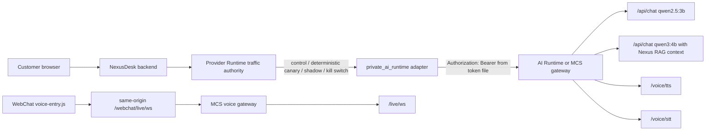

# Private AI Runtime Rollout Runbook

This runbook wires NexusDesk to a server-side AI Runtime without exposing the runtime token to customer browsers or `widget.js`.

## Target Scope



## Server Secrets

Create an app-readable, root-managed token file on the server. Do not put the token in `deploy/.env.prod`, nginx config, `widget.js`, or browser-visible HTML.

```bash
install -d -m 0750 -o root -g 101 /opt/nexus_helpdesk/deploy/runtime_secrets
printf '%s' "$AI_RUNTIME_TOKEN" > /opt/nexus_helpdesk/deploy/runtime_secrets/ai_runtime_token
chown 100:101 /opt/nexus_helpdesk/deploy/runtime_secrets/ai_runtime_token
chmod 0400 /opt/nexus_helpdesk/deploy/runtime_secrets/ai_runtime_token
unset AI_RUNTIME_TOKEN
```

The compose templates mount that file read-only to `/run/nexus/ai_runtime_token`.

Rotate the token before production cutover if it has been shared in chat, logs, screenshots, or shell history.

## Candidate Env

Use these values in the candidate env first. Replace the base URL with the approved MCS gateway when it is available; direct public-IP access is acceptable only as a temporary server-to-server bridge.

```env
PRIVATE_AI_RUNTIME_ENABLED=true
PRIVATE_AI_RUNTIME_BASE_URL=http://47.87.143.41:18081
PRIVATE_AI_RUNTIME_RAG_BASE_URL=http://rag-ai-runtime.internal:18081
PRIVATE_AI_RUNTIME_ALLOW_SHARED_RAG_MODEL=false
PRIVATE_AI_RUNTIME_TOKEN_FILE=/run/nexus/ai_runtime_token
PRIVATE_AI_RUNTIME_DIRECT_PATH=/api/chat
PRIVATE_AI_RUNTIME_RAG_PATH=/api/chat
PRIVATE_AI_RUNTIME_CHAT_MODE=direct
PRIVATE_AI_RUNTIME_REQUEST_SHAPE=ollama_chat
PRIVATE_AI_RUNTIME_DIRECT_MODEL=qwen2.5:3b
PRIVATE_AI_RUNTIME_RAG_MODEL=qwen3:4b
PRIVATE_AI_RUNTIME_DIRECT_MODEL_POLICY=fixed
PRIVATE_AI_RUNTIME_TIMEOUT_SECONDS=20
PRIVATE_AI_RUNTIME_MAX_PROMPT_CHARS=3500
PRIVATE_AI_RUNTIME_MAX_OUTPUT_CHARS=1200
PRIVATE_AI_RUNTIME_OLLAMA_KEEP_ALIVE=30m

PROVIDER_RUNTIME_PRIMARY_PROVIDER=private_ai_runtime
PROVIDER_RUNTIME_FALLBACK_PROVIDERS=[]
PROVIDER_RUNTIME_OUTPUT_CONTRACT=nexus.webchat_runtime_reply
PROVIDER_RUNTIME_TIMEOUT_MS=30000
PROVIDER_RUNTIME_TRAFFIC_MODE=control
PROVIDER_RUNTIME_CANARY_PERCENT=0
PROVIDER_RUNTIME_KILL_SWITCH=false
```

`PROVIDER_RUNTIME_TRAFFIC_MODE` is the server-owned authority:

- `control`: do not call the candidate Provider and do not create customer-visible authority;
- `shadow`: call the candidate only for bounded observation, discard its text and decision authority;
- `canary`: use the persisted `0/1/5/25/100` percentage with a stable SHA-256 bucket over tenant, channel, session and scenario identity;
- `PROVIDER_RUNTIME_KILL_SWITCH=true`: overrides every mode and percentage and prevents candidate execution.

A missing routing rule is always `control` with `0%`; it is never an implicit full-traffic authorization. Invalid mode, percentage, Provider, fallback or output-contract configuration fails closed.

Keep `PRIVATE_AI_RUNTIME_CHAT_MODE=direct` for customer-facing WebChat unless the heavier RAG model has its own isolated Runtime host. In production, Nexus fails closed if `rag|auto` would load a different RAG model on the same Runtime origin while `PRIVATE_AI_RUNTIME_ALLOW_SHARED_RAG_MODEL=false`.

For the live voice media edge, configure the Nexus callback and shared token on the media host. The media edge performs VAD, STT and TTS only; it must not call an LLM or knowledge service directly:

```env
NEXUS_LIVE_VOICE_TURN_URL=https://<nexus-host>/api/internal/live-voice/turn
LIVE_VOICE_SHARED_TOKEN_FILE=/run/nexus/live_voice_token
LIVE_VOICE_API_URL=http://127.0.0.1:8010
LIVE_VOICE_GERMAN_TTS_URL=http://127.0.0.1:8040
```

For Knowledge Runtime, only enable OpenAI-compatible embeddings after confirming the runtime exposes `/v1/embeddings` and the vector dimension:

```env
KNOWLEDGE_EMBEDDINGS_ENABLED=true
KNOWLEDGE_EMBEDDING_PROVIDER=openai_compatible
KNOWLEDGE_EMBEDDING_BASE_URL=http://47.87.143.41:18081/v1
KNOWLEDGE_EMBEDDING_API_KEY_FILE=/run/nexus/ai_runtime_token
KNOWLEDGE_EMBEDDING_MODEL=BAAI/bge-m3
KNOWLEDGE_EMBEDDING_DIM=<confirmed_dimension>
KNOWLEDGE_VECTOR_FALLBACK_ALLOWED=false
```

If the runtime only supports `/rag/search` and `/rag/upsert`, keep `KNOWLEDGE_EMBEDDINGS_ENABLED` on the existing Nexus pgvector path and route answer generation through `PRIVATE_AI_RUNTIME_CHAT_MODE=rag` or `auto`.

## Smoke

Run the upstream smoke from the app image or backend workspace:

```bash
python backend/scripts/smoke_private_ai_runtime.py \
  --base-url http://47.87.143.41:18081 \
  --token-file /run/nexus/ai_runtime_token \
  --request-shape ollama_chat \
  --include-rag \
  --include-live-health \
  --include-tts
```

Warm the customer-facing direct model before sending public traffic or after restarting the app/worker containers:

```bash
python scripts/smoke/warm_private_ai_runtime.py
```

In Docker deployments, run it inside the app container so it uses the mounted server-side token file:

```bash
docker compose --env-file deploy/.env.prod -f deploy/docker-compose.server.yml \
  exec -T app python /app/scripts/smoke/warm_private_ai_runtime.py
```

Treat warmup as a deployment gate, not a container healthcheck. A warmup failure should block cutover or page the operator; it should not restart healthy web services in a loop. Expected warmed `qwen2.5:3b` customer-facing timings are: short greeting/support prompts around 1 second end-to-end and trusted tracking fact prompts under 4 seconds end-to-end. A `load_duration_ms` spike after deploy means the model was cold and the first customer would have paid that latency.

Then run candidate WebChat smoke against the candidate app port. Provider audit rows must contain only bounded traffic identity and safe status metadata; they must never contain prompts, Provider payloads, customer text or secret values.

## Cutover

1. Start candidate with `PROVIDER_RUNTIME_TRAFFIC_MODE=control`, `PROVIDER_RUNTIME_CANARY_PERCENT=0` and the kill switch available.
2. Pass health, readiness and synthetic smoke; confirm audit events report `path=control` and no Provider adapter call.
3. Set `PROVIDER_RUNTIME_TRAFFIC_MODE=shadow`; confirm Provider execution is observable but no candidate text, Ticket, Tool, queue, handoff, outbound or customer-visible authority is returned.
4. Set `PROVIDER_RUNTIME_TRAFFIC_MODE=canary` and raise the percentage from `1` to `5`, `25` and `100`. The same tenant/channel/session/scenario identity must remain in the same bucket across retries and request IDs.
5. Keep `PROVIDER_RUNTIME_FALLBACK_PROVIDERS=[]`; backend fallback must return `reply:null`, not customer-visible text.
6. Roll back instantly with:

```env
PROVIDER_RUNTIME_KILL_SWITCH=true
```

The environment may activate the kill switch but may not clear a persisted tenant/channel kill switch.

## Production Gates

- Token is present only in a server-side file.
- Browser network traces do not contain `47.87.143.41`, bearer tokens, or upstream WS query tokens.
- WebChat runtime returns valid `nexus.webchat_runtime_reply` output from `private_ai_runtime` only on the deterministic authoritative canary path.
- Control and shadow outcomes have no customer-visible or operational authority.
- Live tracking status is never claimed without trusted tracking evidence.
- WebCall voice remains same-origin through `/webchat/live/ws`.
- RAG embedding dimension is confirmed before writing production vectors.
- Release evidence records the exact source SHA, traffic mode, canary percentage and kill-switch state without logging controlled text.
