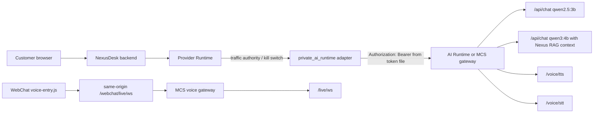

# Private AI Runtime Rollout Runbook

This runbook wires NexusDesk to a server-side AI Runtime without exposing the runtime token to customer browsers or `widget.js`.

## Target Scope



The model names above describe the legacy Runtime identity at the time this traffic-authority contract was written. Capability and model identity verification is owned separately by #586; this runbook must not be treated as proof that those names match a running Runtime.

## Server Secrets

Create an app-readable, root-managed token file on the server. Do not put the token in `deploy/.env.prod`, nginx config, `widget.js`, or browser-visible HTML.

```bash
install -d -m 0750 -o root -g 101 /opt/nexus_helpdesk/deploy/runtime_secrets
printf '%s' "$AI_RUNTIME_TOKEN" > /opt/nexus_helpdesk/deploy/runtime_secrets/ai_runtime_token
chown 100:101 /opt/nexus_helpdesk/deploy/runtime_secrets/ai_runtime_token
chmod 0400 /opt/nexus_helpdesk/deploy/runtime_secrets/ai_runtime_token
unset AI_RUNTIME_TOKEN
```

The compose templates mount that file read-only to `/run/nexus/ai_runtime_token`.

Rotate the token before production cutover if it has been shared in chat, logs, screenshots, or shell history.

## Candidate Env

Use these values in the candidate env first. Replace the base URL with the approved MCS gateway when it is available; direct public-IP access is acceptable only as a temporary server-to-server bridge.

```env
PRIVATE_AI_RUNTIME_ENABLED=true
PRIVATE_AI_RUNTIME_BASE_URL=http://47.87.143.41:18081
PRIVATE_AI_RUNTIME_RAG_BASE_URL=http://rag-ai-runtime.internal:18081
PRIVATE_AI_RUNTIME_ALLOW_SHARED_RAG_MODEL=false
PRIVATE_AI_RUNTIME_TOKEN_FILE=/run/nexus/ai_runtime_token
PRIVATE_AI_RUNTIME_DIRECT_PATH=/api/chat
PRIVATE_AI_RUNTIME_RAG_PATH=/api/chat
PRIVATE_AI_RUNTIME_CHAT_MODE=direct
PRIVATE_AI_RUNTIME_REQUEST_SHAPE=ollama_chat
PRIVATE_AI_RUNTIME_DIRECT_MODEL=qwen2.5:3b
PRIVATE_AI_RUNTIME_RAG_MODEL=qwen3:4b
PRIVATE_AI_RUNTIME_DIRECT_MODEL_POLICY=fixed
PRIVATE_AI_RUNTIME_TIMEOUT_SECONDS=20
PRIVATE_AI_RUNTIME_MAX_PROMPT_CHARS=3500
PRIVATE_AI_RUNTIME_MAX_OUTPUT_CHARS=1200
PRIVATE_AI_RUNTIME_OLLAMA_KEEP_ALIVE=30m

PROVIDER_RUNTIME_PRIMARY_PROVIDER=private_ai_runtime
PROVIDER_RUNTIME_FALLBACK_PROVIDERS=[]
PROVIDER_RUNTIME_OUTPUT_CONTRACT=nexus_webchat_runtime_reply_v1
PROVIDER_RUNTIME_TIMEOUT_MS=30000
PROVIDER_RUNTIME_TRAFFIC_MODE=control
PROVIDER_RUNTIME_CANARY_PERCENT=0
PROVIDER_RUNTIME_KILL_SWITCH=false
```

The committed candidate and production examples intentionally default to `control` plus `0`. Copying an example must never grant candidate authority. Shadow and canary are explicit rollout mutations after their gates pass.

Keep `PRIVATE_AI_RUNTIME_CHAT_MODE=direct` for customer-facing WebChat unless the heavier RAG model has its own isolated Runtime host. In production, Nexus fails closed if `rag|auto` would load a different RAG model on the same Runtime origin while `PRIVATE_AI_RUNTIME_ALLOW_SHARED_RAG_MODEL=false`.

## Provider Traffic Authority

`PROVIDER_RUNTIME_TRAFFIC_MODE` is the server-owned authority that gives `PROVIDER_RUNTIME_CANARY_PERCENT` its meaning:

- `canary`: calculate a stable bucket from server-owned Tenant, channel, session/conversation and scenario identity. The candidate Provider is authoritative only when `bucket < canary_percent`.
- `shadow`: call and validate the candidate Provider, record bounded audit evidence, then discard its output. Shadow output cannot become customer-visible and cannot execute a tool, create a ticket, enqueue work or perform an external action.
- `control`: do not call the candidate Provider. The router returns an explicit unavailable/control result so the existing governed caller can retain its approved control behavior.
- `PROVIDER_RUNTIME_KILL_SWITCH=true`: emergency authority that prevents the candidate call. A valid true kill switch remains effective even when lower-priority mode or percentage data is malformed; those defects are recorded as bounded configuration errors.

The exact traffic bucket contract is:

```text
sha256(tenant_id,tenant_key,channel_key,session_id,scenario)%100
```

The contract deliberately excludes random state, request IDs and worker identity. Reconstructing the same scoped request after a retry, worker change or restart therefore yields the same bucket. Changing Tenant, Tenant key, channel, session/conversation or scenario may deliberately produce a different bucket.

Audit rows include only bounded `traffic_selection` evidence: schema version, configured mode, configuration errors, percentage, bucket, selected path, authoritative flag and reason. No customer message, token or upstream payload belongs in this summary.

Traffic configuration is fail-closed. Any unsupported or explicitly empty mode, non-canonical/non-integer/out-of-range percentage, non-boolean persisted kill switch, or unsupported kill-switch environment value prevents a candidate call. The Router returns a bounded fixed error code and Admin status becomes `misconfigured`; Nexus does not silently clamp, coerce or substitute a permissive value.

For WebCall AI production providers:

```env
WEBCALL_AI_PRODUCTION_ENABLED=true
WEBCALL_AI_AGENT_ENABLED=true
WEBCALL_AI_PUBLIC_ROLLOUT_MODE=internal
WEBCALL_AI_PROVIDER_PROFILE=external
STT_PROVIDER=external
LLM_PROVIDER=external
TTS_PROVIDER=external
STT_ENDPOINT=http://47.87.143.41:18081/voice/stt
LLM_ENDPOINT=http://47.87.143.41:18081/chat/direct
TTS_ENDPOINT=http://47.87.143.41:18081/voice/tts
STT_API_KEY_FILE=/run/nexus/ai_runtime_token
LLM_API_KEY_FILE=/run/nexus/ai_runtime_token
TTS_API_KEY_FILE=/run/nexus/ai_runtime_token
TTS_VOICE=af_heart
```

For Knowledge Runtime, only enable OpenAI-compatible embeddings after confirming the runtime exposes `/v1/embeddings` and the vector dimension:

```env
KNOWLEDGE_RUNTIME_VERSION=v2
KNOWLEDGE_EMBEDDINGS_ENABLED=true
KNOWLEDGE_EMBEDDING_PROVIDER=openai_compatible
KNOWLEDGE_EMBEDDING_BASE_URL=http://47.87.143.41:18081/v1
KNOWLEDGE_EMBEDDING_API_KEY_FILE=/run/nexus/ai_runtime_token
KNOWLEDGE_EMBEDDING_MODEL=BAAI/bge-m3
KNOWLEDGE_EMBEDDING_DIM=<confirmed_dimension>
KNOWLEDGE_VECTOR_FALLBACK_ALLOWED=false
```

If the runtime only supports `/rag/search` and `/rag/upsert`, keep `KNOWLEDGE_EMBEDDINGS_ENABLED` on the existing Nexus pgvector path and route answer generation through `PRIVATE_AI_RUNTIME_CHAT_MODE=rag` or `auto`.

## Smoke

Run the upstream smoke from the app image or backend workspace:

```bash
python backend/scripts/smoke_private_ai_runtime.py \
  --base-url http://47.87.143.41:18081 \
  --token-file /run/nexus/ai_runtime_token \
  --request-shape ollama_chat \
  --include-rag \
  --include-live-health \
  --include-tts
```

Warm the customer-facing direct model before sending public traffic or after restarting the app/worker containers:

```bash
python scripts/smoke/warm_private_ai_runtime.py
```

In Docker deployments, run it inside the app container so it uses the mounted server-side token file:

```bash
docker compose --env-file deploy/.env.prod -f deploy/docker-compose.server.yml \
  exec -T app python /app/scripts/smoke/warm_private_ai_runtime.py
```

Treat warmup as a deployment gate, not a container healthcheck. A warmup failure should block cutover or page the operator; it should not restart healthy web services in a loop. Expected timings and the actual model identity must come from the #586 capability proof rather than stale names in this document.

Then run candidate WebChat smoke against the candidate app port. Provider audit rows must show the expected `traffic_selection.path`, no secret values, and parse rejects, health skips and timeouts must retain bounded traffic evidence and fail closed.

## Cutover

1. Start with `PROVIDER_RUNTIME_TRAFFIC_MODE=control` and `PROVIDER_RUNTIME_CANARY_PERCENT=0`. Prove that no candidate call occurs.
2. Set `PROVIDER_RUNTIME_TRAFFIC_MODE=shadow`. Pass smoke and inspect bounded `shadow_generate` audit rows; prove that no customer reply or side effect is produced from the shadow output.
3. Set `PROVIDER_RUNTIME_TRAFFIC_MODE=canary` while keeping the percentage at `0`; confirm the control path remains authoritative.
4. Raise canary to `1`, then `5`, then `25`, then `100`, with a defined observation window and rollback threshold at each step.
5. Keep `PROVIDER_RUNTIME_FALLBACK_PROVIDERS=[]`; backend fallback must return `reply:null`, not customer-visible text.
6. Roll back instantly with:

```env
PROVIDER_RUNTIME_KILL_SWITCH=true
```

The valid true kill switch is higher priority than `control`, `shadow`, `canary`, percentage validation and mode validation. It suppresses candidate execution while still surfacing lower-priority configuration defects for repair.

## Production Gates

- Token is present only in a server-side file.
- Browser network traces do not contain `47.87.143.41`, bearer tokens, or upstream WS query tokens.
- Traffic mode, percentage, bucket contract, Admin status and audit path use `nexus.provider_runtime.traffic_selection.v1` consistently.
- Invalid effective or persisted traffic configuration is `misconfigured` and performs no candidate call.
- `0%` never sends an authoritative candidate request.
- Identical server-owned scope maps to the same bucket across retries, workers and restarts.
- Shadow output never becomes customer-visible and never performs a side effect.
- A valid true kill switch suppresses every candidate call, including when lower-priority settings are malformed.
- Health skips, timeouts and parse rejects retain bounded traffic-selection evidence.
- WebChat runtime returns valid `nexus_webchat_runtime_reply_v1` output from `private_ai_runtime` only on an authoritative candidate path.
- Live tracking status is never claimed without trusted tracking evidence.
- WebCall voice remains same-origin through `/webchat/live/ws`.
- Runtime capability/model identity is proven through #586 before rollout.
- RAG embedding dimension is confirmed before writing production vectors.
