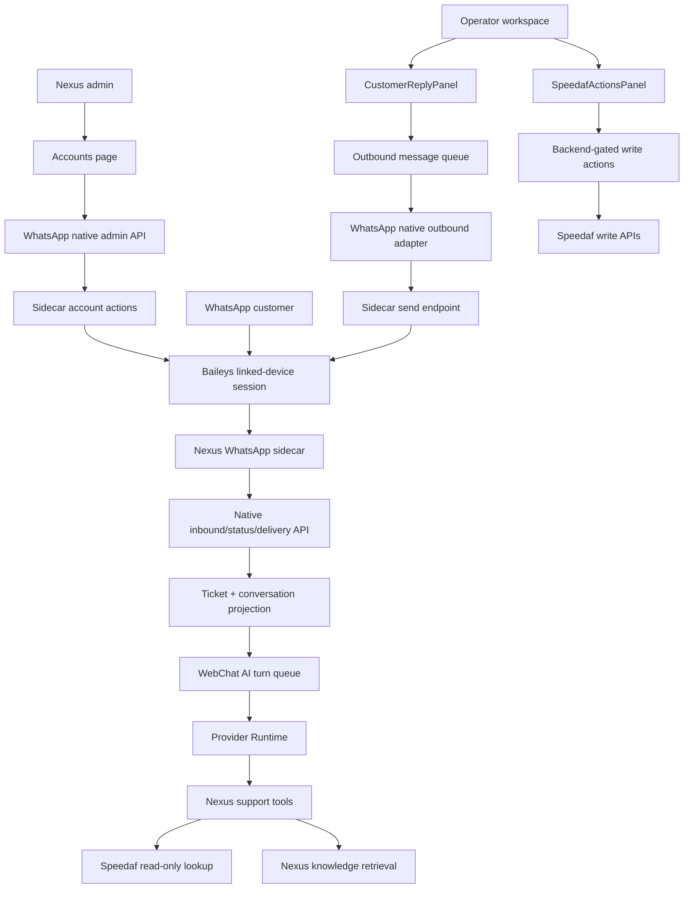

# Nexus Native WhatsApp + Speedaf Support Tools Landing Plan

Date: 2026-06-30

Scope: turn the current retired vendor runtime-backed WhatsApp/support-agent capabilities into Nexus-native production capabilities. This is a delivery plan, not a deployment record.

## End State

The target user experience is:

1. Admin opens Nexus backend.
2. Admin creates a WhatsApp channel account.
3. Admin clicks "start QR login" and scans the WhatsApp linked-device QR code.
4. Nexus shows the account as connected.
5. Customer sends a WhatsApp message.
6. Nexus ingests the message into ticket + conversation.
7. Nexus AI can use trusted Speedaf tools for tracking facts.
8. Nexus AI or operator replies through the same WhatsApp channel.
9. Every Speedaf lookup/action and every external send is audited, gated, and rollbackable.

Target runtime:

```text
WhatsApp customer
  -> Nexus WhatsApp sidecar
  -> Nexus native inbound API
  -> Ticket / WebchatConversation / WebchatMessage
  -> WebChat AI / Provider Runtime
  -> Nexus outbound queue
  -> Nexus WhatsApp sidecar
  -> WhatsApp customer
```

retired vendor runtime remains only a historical reference during migration. It must not be required by the final runtime path.

## Current Fact Base

### retired vendor runtime Side

Observed on `178.105.160.174`:

- retired vendor runtime gateway runs on `127.0.0.1:18789`.
- Speedy Console is a static SPA at `/speedy-console/`.
- nginx proxies `/api/support/conversations*` and `/api/support/knowledge/*` to retired vendor runtime gateway.
- retired vendor runtime support agent uses one MCP server named `speedaf-support`.
- That MCP server is implemented at `/root/.retired_vendor_runtime/agents/support/workspace/mcp/support_mcp_server.py`.
- The allowed tools are:
  - `speedaf_lookup`
  - `speedaf_query_waybills`
  - `speedaf_update_address`
  - `speedaf_cancel_order`
  - `speedaf_create_work_order`
  - `support_knowledge_retrieve`
- retired vendor runtime QR/session material exists under retired vendor runtime runtime paths and must not be copied into Git or treated as source code.

### Nexus Side

Current Nexus source already has these building blocks:

- WhatsApp sidecar:
  - `connectors/whatsapp-sidecar`
  - `src/server.ts`
  - `src/baileysClient.ts`
  - `src/backendClient.ts`
  - `src/sessionStore.ts`
- WhatsApp native backend:
  - `backend/app/api/admin_whatsapp_native.py`
  - `backend/app/api/whatsapp_native_integration.py`
  - `backend/app/services/whatsapp_native_admin.py`
  - `backend/app/services/whatsapp_native_inbound.py`
  - `backend/app/services/outbound_adapters/whatsapp_native.py`
- Operator and account UI:
  - `webapp/src/routes/accounts.tsx`
  - `webapp/src/components/operator/CustomerReplyPanel.tsx`
  - `webapp/src/components/operator/SpeedafActionsPanel.tsx`
- Speedaf tools:
  - `backend/app/services/speedaf/client.py`
  - `backend/app/services/speedaf/adapter.py`
  - `backend/app/services/speedaf/action_service.py`
  - `backend/app/services/tracking_fact_service.py`
  - `backend/app/api/speedaf_actions.py`
  - `backend/app/api/speedaf_cancel.py`
- GitHub Actions already exist for Speedaf and sidecar validation:
  - `.github/workflows/whatsapp-sidecar-ci.yml`
  - `.github/workflows/speedaf-contract-gate.yml`
  - `.github/workflows/speedaf-readonly-uat-probe.yml`
  - `.github/workflows/speedaf-full-uat-probe.yml`
  - `.github/workflows/knowledge-runtime-readiness.yml`

### Production Drift To Fix

Observed production currently has a split runtime:

- Public candidate app is `126ec570f3ef...`.
- GitHub `main` was observed at `1a0f6fa2d6a0...`.
- WhatsApp sidecar currently calls `NEXUS_BACKEND_URL=http://app:8080`, which points to legacy `deploy-app-1`.
- Candidate app has `WHATSAPP_NATIVE_ENABLED=true`, but `WHATSAPP_DISPATCH_MODE=disabled`.
- Legacy app/worker still have bridge-mode behavior in runtime configuration.
- Active business DB is `nexus-clean-postgres-1/nexusdesk`, not `deploy-postgres-1`.

## Capability Mapping

| retired vendor runtime tool/capability | Nexus target | Status |
| --- | --- | --- |
| WhatsApp QR bind | `accounts.tsx` -> `admin_whatsapp_native.py` -> sidecar `/accounts/:id/start|qr|status` | Exists, needs production wiring and smoke. |
| WhatsApp inbound | sidecar -> `/api/integrations/whatsapp/native/inbound` -> `whatsapp_native_inbound.py` | Exists, needs candidate callback wiring. |
| WhatsApp outbound reply | `CustomerReplyPanel` -> outbound queue -> `whatsapp_native.py` -> sidecar `/send` | Exists, currently disabled in candidate runtime. |
| `speedaf_lookup` | `tracking_fact_service.py` -> `SpeedafCoreAdapter.query_order_tracking_fact` | Exists. |
| `speedaf_query_waybills` | `SpeedafCoreAdapter.query_waybills_by_caller` | Exists. |
| `speedaf_create_work_order` | `speedaf_actions.py` + `SpeedafActionService.create_work_order` | Exists behind feature flag. |
| `speedaf_update_address` | `speedaf_actions.py` + `submit_update_address_flow` | Exists behind feature flag. |
| `speedaf_cancel_order` | `speedaf_cancel.py` + confirmation token + `cancel_order` | Exists behind feature flag. |
| `support_knowledge_retrieve` | Nexus knowledge/support-intelligence read model | Partial; should be Nexus DB-backed, not retired vendor runtime memory-backed. |
| Speedy Console conversation list | Nexus-native WhatsApp conversation API over DB | Needs rewrite. |

## Target Architecture



## Delivery Phases

### Phase 1: Source-Control The Runtime Contract

Goal: make the intended runtime explicit before touching production.

Tasks:

- Keep sidecar as a first-class Nexus service, not a host-only overlay.
- Template compose so sidecar callback target is explicit.
- Define candidate app + candidate worker + sidecar in one controlled runtime topology.
- Ensure candidate env supports:
  - `WHATSAPP_NATIVE_ENABLED=true`
  - `WHATSAPP_DISPATCH_MODE=native_sidecar`
  - `WEBCHAT_TRACKING_FACT_SOURCE=speedaf_api`
  - `SPEEDAF_MCP_ENABLED=true` only when secrets are present.
- Keep write flags default-off:
  - `SPEEDAF_WORK_ORDER_CREATE_ENABLED=false`
  - `SPEEDAF_UPDATE_ADDRESS_ENABLED=false`
  - `SPEEDAF_CANCEL_ENABLED=false`
  - `SPEEDAF_VOICE_CALLBACK_ENABLED=false`

Acceptance:

- Compose/env templates contain no secrets.
- Candidate path can run without retired vendor runtime gateway/bridge.
- CI verifies production settings reject invalid WhatsApp dispatch modes.

### Phase 2: WhatsApp QR Binding MVP

Goal: admin can bind WhatsApp from Nexus UI.

Existing flow to use:

```text
webapp/src/routes/accounts.tsx
  -> /api/admin/whatsapp/accounts/:account_id/login/start
  -> whatsapp_native_admin.py
  -> sidecar /accounts/:account_id/start
  -> Baileys QR
  -> sidecar /accounts/:account_id/qr
  -> UI renders qr_data_url
```

Tasks:

- Keep `ChannelAccount` as the source of account metadata.
- Store sidecar sessions only under server private runtime storage.
- Add/verify QR state polling:
  - `idle`
  - `connecting`
  - `qr_pending`
  - `connected`
  - `reconnecting`
  - `disconnected`
  - `error`
- Ensure admin UI never displays secrets or raw session files.
- Add smoke test for sidecar `/healthz`, `/readyz`, `/accounts/:id/status`, and QR lifecycle with mock mode.

Acceptance:

- Admin can create/select a WhatsApp account and start QR login.
- QR appears in Nexus backend.
- Connected state updates health to `healthy`.
- Logout/restart works from Nexus UI.

### Phase 3: Native WhatsApp Inbound

Goal: customer WhatsApp messages create Nexus tickets/conversations.

Existing flow to use:

```text
Baileys messages.upsert
  -> normalizeBaileysInbound
  -> BackendClient.postInbound
  -> /api/integrations/whatsapp/native/inbound
  -> ingest_whatsapp_native_inbound
  -> WhatsAppInboundMessage
  -> Ticket
  -> WebchatConversation
  -> WebchatMessage
  -> webchat_ai_reply job
```

Tasks:

- Point sidecar callback to candidate app service in candidate compose.
- Keep HMAC callback verification.
- Keep inbound idempotency by account + external message id.
- Keep `from_me` handling:
  - default ignore
  - store-only mode for self messages
  - test-visitor mode only with explicit prefix.
- Add candidate smoke for self-echo test prefix before real customer traffic.

Acceptance:

- One WhatsApp inbound creates exactly one `WhatsAppInboundMessage`.
- It creates/reuses the right `Ticket` and `WebchatConversation`.
- It enqueues exactly one AI turn.
- Duplicate inbound does not duplicate ticket/message/AI job.

### Phase 4: Native WhatsApp AI Reply

Goal: Nexus AI replies through the same WhatsApp channel.

Existing flow to use:

```text
AI result / operator reply
  -> TicketOutboundMessage
  -> message_dispatch
  -> dispatch_whatsapp_native_outbound
  -> sidecar /accounts/:id/send
  -> WhatsApp
  -> delivery callback
  -> outbound row status update
```

Tasks:

- Run candidate app and outbound worker with `WHATSAPP_DISPATCH_MODE=native_sidecar`.
- Stop or isolate legacy bridge-mode worker before native cutover.
- Keep `CustomerReplyPanel` external-send confirmation.
- Keep outbound safety gate before provider send.
- Require active WhatsApp `ChannelAccount`.
- Route by ticket `channel_account_id`, conversation link, market fallback, then global account.

Acceptance:

- WebChat/WhatsApp conversation with `preferred_reply_channel=whatsapp` can queue a reply.
- Worker sends through sidecar.
- Delivery callback marks sent/failed.
- No retired vendor runtime bridge dispatch happens in candidate path.

### Phase 5: Nexus-Native WhatsApp Conversation Read Model

Goal: replace Speedy Console / WhatsApp Lite dependence on retired vendor runtime support APIs.

Tasks:

- Implement Nexus-native conversation list/detail over:
  - `webchat_conversations`
  - `whatsapp_inbound_messages`
  - `tickets`
  - `ticket_outbound_messages`
  - ticket timeline/events
- Keep customer-safe fields:
  - channel
  - account id/display name
  - customer display
  - latest message
  - status
  - last activity
  - assigned operator
  - AI state
- Retire bridge-backed `whatsapp_lite` read path or leave it as disabled compatibility only.
- Move any useful Speedy Console UX into Nexus workspace, not into a separate runtime dependency.

Acceptance:

- Nexus can list WhatsApp conversations without retired vendor runtime `/api/support/conversations`.
- Detail view shows inbound and outbound messages from Nexus DB.
- retired vendor runtime gateway can be unavailable without breaking Nexus WhatsApp workspace.

### Phase 6: Speedaf Read-Only Tools In AI Runtime

Goal: give Nexus AI the same useful lookup capability as retired vendor runtime support agent, but with Nexus safety.

retired vendor runtime tools to map:

```text
speedaf_lookup
speedaf_query_waybills
support_knowledge_retrieve
```

Nexus implementation:

- `speedaf_lookup` maps to `lookup_tracking_fact`.
- `speedaf_query_waybills` maps to `SpeedafCoreAdapter.query_waybills_by_caller`.
- `support_knowledge_retrieve` maps to Nexus knowledge/support-intelligence, not retired vendor runtime memory.

Rules:

- AI may use read-only tracking facts.
- AI must not claim live parcel status unless `fact_evidence_present=true`.
- Prompt gets only sanitized tracking fact metadata.
- Public response gets tracking suffix/hash, not full raw number unless already customer-provided in the chat.
- Tool calls are recorded in `ToolCallLog`.

Acceptance:

- Customer asks "where is my parcel" with waybill: Nexus does Speedaf read-only lookup before AI answer.
- Customer gives phone but no waybill: Nexus finds candidate waybills or asks for clarification.
- Knowledge retrieval cannot answer live shipment state without Speedaf evidence.
- No raw app code, secret key, full phone, full address, or raw Speedaf response leaks to frontend/logs/prompt.

### Phase 7: Speedaf Write Actions For Operators

Goal: support the same action family as retired vendor runtime while preventing AI from directly executing risky operations.

retired vendor runtime tools to map:

```text
speedaf_create_work_order
speedaf_update_address
speedaf_cancel_order
```

Nexus implementation:

- Work order:
  - UI: `SpeedafActionsPanel`
  - API: `POST /api/tickets/:ticket_id/speedaf/work-orders`
  - Service: `SpeedafActionService.create_work_order`
  - Feature flag: `SPEEDAF_WORK_ORDER_CREATE_ENABLED`
- WhatsApp/address update:
  - UI: `SpeedafActionsPanel`
  - API: `POST /api/tickets/:ticket_id/speedaf/address-update`
  - Service: `submit_update_address_flow`
  - Feature flag: `SPEEDAF_UPDATE_ADDRESS_ENABLED`
- Cancel order:
  - Preview API checks current status and creates confirmation token.
  - Confirm API verifies token and executes cancel.
  - Feature flag: `SPEEDAF_CANCEL_ENABLED`

Rules:

- AI can recommend an action.
- Operator must click and confirm.
- Backend checks capability, rate limit, idempotency, and feature flag.
- Every action writes `ToolCallLog` and `TicketEvent`.

Acceptance:

- Without feature flag, action APIs return disabled.
- Without capability, action APIs return forbidden.
- Duplicate update/cancel/work-order requests are deduped.
- Terminal shipment states block cancel.
- All output is redacted.

### Phase 8: CI And GitHub-First Validation

Use GitHub Actions as the primary validation path.

Required CI gates:

- `whatsapp-sidecar-ci`
  - npm ci
  - typecheck
  - tests
  - build
- backend focused tests:
  - `test_admin_whatsapp_native_api.py`
  - `test_whatsapp_native_inbound_integration.py`
  - `test_whatsapp_native_outbound_adapter.py`
  - `test_whatsapp_outbound_adapter.py`
  - `test_speedaf_tracking_fact_source.py`
  - `test_tracking_fact_service_speedaf_source.py`
  - `test_speedaf_action_service.py`
  - `test_speedaf_workorder_address_actions.py`
  - `test_speedaf_cancel_controlled_action.py`
  - `test_support_intelligence_config.py`
- `speedaf-contract-gate`
- `speedaf-readonly-uat-probe`
- `knowledge-runtime-readiness`

No production cutover should happen from local-only test evidence.

### Phase 9: Candidate Smoke And Controlled Cutover

Candidate smoke order:

1. `/healthz` and `/readyz` release metadata.
2. sidecar `/healthz` and `/readyz`.
3. admin WhatsApp account status through Nexus auth.
4. QR start/status in mock or isolated account mode.
5. native inbound self-echo with test prefix.
6. Speedaf read-only lookup with UAT/test credentials.
7. WebChat/WhatsApp AI reply with trusted tracking fact.
8. One explicit outbound WhatsApp send only after manual approval.

Cutover rules:

- Stop/isolate legacy bridge-mode outbound workers first.
- Ensure sidecar callback points to candidate app.
- Ensure candidate outbound worker is the only worker processing WhatsApp sends.
- Keep previous compose/env snapshots for rollback.

Rollback:

- Set `WHATSAPP_DISPATCH_MODE=disabled` or restore previous worker path.
- Point sidecar callback target back to previous backend if needed.
- Keep sidecar session directory intact.
- Disable Speedaf write flags.
- Keep read-only tracking enabled only if it is independently healthy.

## Work Breakdown

### PR 1: Runtime Contract And Docs

Files:

- `deploy/docker-compose.whatsapp-sidecar.example.yml`
- candidate compose/env templates
- production runbook docs
- settings contract tests

Outcome:

- No behavior switch.
- Runtime topology becomes explicit.

### PR 2: WhatsApp QR Binding And Sidecar Smoke

Files:

- `connectors/whatsapp-sidecar/src/*`
- `backend/app/api/admin_whatsapp_native.py`
- `backend/app/services/whatsapp_native_admin.py`
- `webapp/src/routes/accounts.tsx`
- sidecar/backend tests

Outcome:

- Admin can bind, inspect, restart, and logout WhatsApp from Nexus.

### PR 3: Native Inbound + Conversation Projection

Files:

- `backend/app/api/whatsapp_native_integration.py`
- `backend/app/services/whatsapp_native_inbound.py`
- inbound tests
- smoke script

Outcome:

- WhatsApp inbound creates Nexus ticket/conversation/AI turn.

### PR 4: Native Outbound Reply

Files:

- `backend/app/services/message_dispatch.py`
- `backend/app/services/outbound_adapters/whatsapp_native.py`
- `backend/app/services/outbound_channel_registry.py`
- `webapp/src/components/operator/CustomerReplyPanel.tsx`
- outbound tests

Outcome:

- Nexus sends customer replies through native WhatsApp sidecar.

### PR 5: Native WhatsApp Conversation Read Model

Files:

- new/updated WhatsApp conversation API
- `backend/app/api/whatsapp_lite.py` compatibility changes
- webapp workspace/inbox routes
- contract tests

Outcome:

- Nexus no longer needs retired vendor runtime `/api/support/conversations`.

### PR 6: Speedaf Read-Only Tool Layer

Files:

- `backend/app/services/tracking_fact_service.py`
- `backend/app/services/speedaf/adapter.py`
- support-intelligence/knowledge retrieval service
- webchat fast reply tests

Outcome:

- AI can answer live tracking only from trusted Speedaf facts.

### PR 7: Speedaf Operator Write Actions

Files:

- `backend/app/api/speedaf_actions.py`
- `backend/app/api/speedaf_cancel.py`
- `backend/app/services/speedaf/action_service.py`
- `webapp/src/components/operator/SpeedafActionsPanel.tsx`
- write-action tests

Outcome:

- Operators can create work orders, submit update requests, and cancel with confirmation.
- AI cannot directly execute these actions.

## Risks And Controls

| Risk | Control |
| --- | --- |
| WhatsApp session leakage | Runtime-only session directory, never Git, never docs. |
| AI sends wrong live tracking answer | Require trusted Speedaf fact evidence before live status claims. |
| AI executes cancel/address update | AI only recommends; backend capability + confirmation required. |
| Duplicate outbound sends | Outbound idempotency key + worker lock + sidecar idempotency. |
| Split runtime sends messages to old app | Candidate compose must set sidecar callback target explicitly. |
| Legacy worker also processes queue | Stop/isolate bridge-mode workers before native send cutover. |
| Speedaf credential leakage | GitHub secrets only; redaction tests; no raw request/response in logs. |
| Baileys/WhatsApp Web instability | Isolate behind sidecar contract; future Cloud API adapter can replace it. |

## Definition Of Done

This program is done when all of the following are true:

- Admin can bind WhatsApp from Nexus without retired vendor runtime.
- WhatsApp inbound creates Nexus ticket/conversation/message.
- Nexus AI can perform trusted Speedaf read-only lookup before replying.
- Nexus can send WhatsApp replies through native sidecar.
- Operators can use Speedaf actions only through gated backend APIs.
- No production path requires retired vendor runtime gateway, retired vendor runtime bridge, or Speedy Console APIs.
- GitHub Actions pass for sidecar, backend, Speedaf contract, and knowledge runtime.
- Candidate smoke passes.
- Rollback runbook is tested at least to dry-run level.
