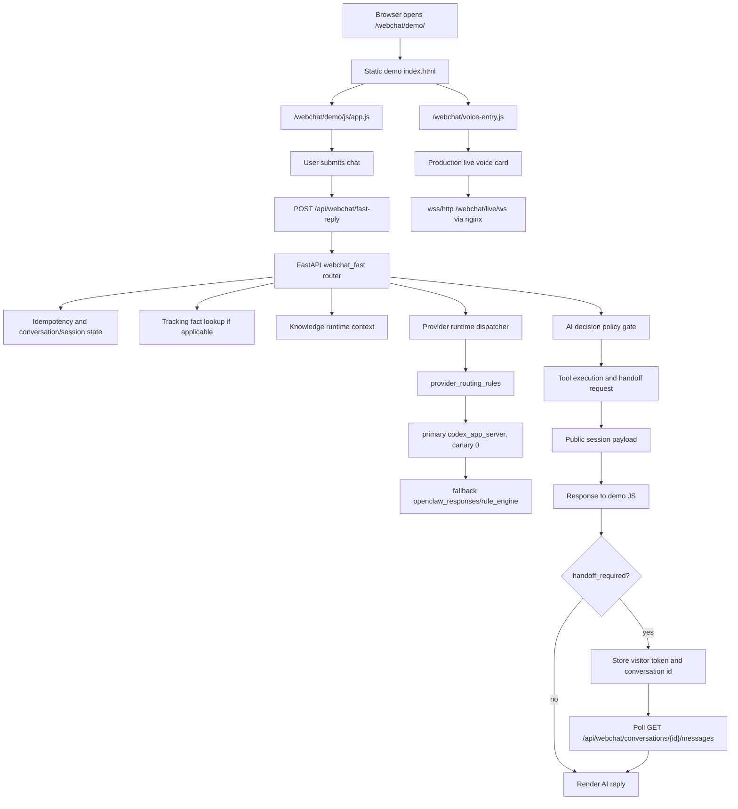
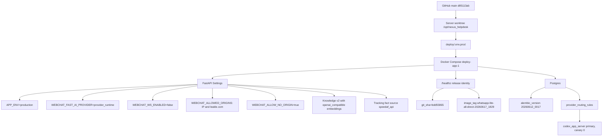
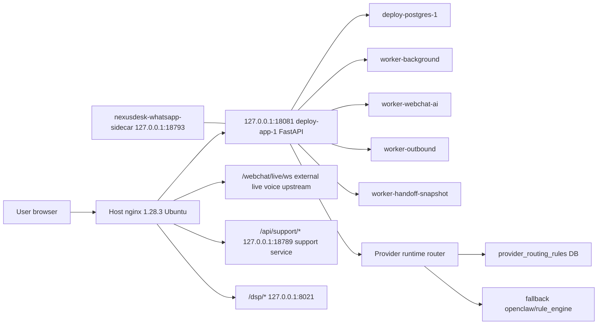

# Production Drift Audit - 2026-06-29

Target: `178.105.160.174`

Repository: `Maximvonshaft/nexus_helpdesk`

Local audit branch: `codex/production-drift-audit-20260629`

## Scope

This audit captured the difference between GitHub `main`, the server checkout,
the running Docker container, and the public nginx edge for the WebChat demo and
support runtime. The collection was read-only for production services. No service
was restarted and no business-write API call was made.

Raw evidence is stored locally under the ignored path:

```text
backend/artifacts/production-drift-audit-20260629/nexus_drift_evidence_20260629.tar.gz
```

Evidence archive SHA256:

```text
64c05cc384e8d59d3d35e0f887673334270849a904f2faa07a227f39f7cebb10
```

Do not commit the raw evidence archive. It contains production hotfix source
samples and files that triggered secret-like marker detection.

## Executive Summary

Production is not a clean deployment of the current GitHub `main` tree.

The observed state has four separate layers:

| Layer | Observed identity | Status |
|---|---:|---|
| GitHub/current main | `d85113ab383f72fef7128322bce016965457ecfd` | Source of truth candidate |
| Server checkout `/opt/nexus_helpdesk` | `d85113ab383f72fef7128322bce016965457ecfd` | Dirty worktree |
| Running app container metadata | `bdd55865c4ebd53f5d3030fc162f71e53308e227` | Stale release identity |
| Running app container filesystem | Mixed | Container overlay has hotfixes and replaced frontend assets |

GitHub compare from `bdd55865` to `d85113ab` reports:

```text
ahead_by=20
79 files changed, 10537 insertions(+), 53 deletions(-)
```

The running container is also mutated after startup:

```text
docker diff deploy-app-1:
200 A
21 C
8 D
```

This means `/healthz` release identity alone is not sufficient evidence of the
runtime code. The container metadata is stale, and the container overlay contains
files that are not represented by a clean image.

## Public Runtime Facts

`/healthz` on the app container returned:

```json
{
  "status": "ok",
  "env": "production",
  "app_version": "main-bdd55865-codex-latency-telemetry",
  "git_sha": "bdd55865c4ebd53f5d3030fc162f71e53308e227",
  "image_tag": "nexusdesk/helpdesk:whatsapp-lite-all-direct-20260617_1829",
  "build_time": "20260605_101304",
  "frontend_build_sha": "bdd55865c4ebd53f5d3030fc162f71e53308e227"
}
```

`/readyz` returned:

```text
status=ready
database=ok
migration_revision=20260612_0017
frontend.active_root=frontend_dist
frontend.frontend_dist_index=present
storage.status=warning
storage.backend=local
```

The storage warning is expected for a pilot only when host-level backup and
restore evidence exist.

## Server Checkout Drift

The server checkout is on current main but dirty:

```text
## main...origin/main
HEAD d85113ab383f72fef7128322bce016965457ecfd
```

Tracked modified files:

```text
backend/app/api/auth.py
backend/app/api/ticket_perf.py
backend/app/main.py
backend/app/services/ai_config_service.py
backend/app/services/openclaw_client_factory.py
backend/app/services/outbound_adapters/whatsapp.py
backend/app/settings.py
backend/app/static/webchat/demo/DEPLOYMENT_NOTES.md
backend/app/static/webchat/demo/index.html
backend/app/static/webchat/voice-entry.js
backend/scripts/openclaw_bridge_server.js
backend/tests/test_webchat_voice_mock_ui_static.py
deploy/systemd/nexusdesk-openclaw-bridge.service
docs/webchat-voice-runtime.md
scripts/probe_webcall_runtime.sh
webapp/src/components/operator/CustomerReplyPanel.tsx
webapp/src/components/ui/CommandPalette.tsx
webapp/src/features/webchat-inbox-v5/WebchatInboxV5Page.tsx
webapp/src/layouts/AppShell.tsx
webapp/src/lib/api.ts
webapp/src/routes/control-plane.tsx
webapp/src/routes/index.tsx
webapp/src/routes/provider-credentials.tsx
webapp/src/routes/runtime.tsx
webapp/src/routes/workspace.tsx
webapp/src/shared/ui/DESIGN_SYSTEM_FOUNDATION.md
webapp/src/shared/ui/radix/README.md
webapp/src/styles.css
```

Untracked review candidates:

```text
backend/app/api/support_intelligence.py
backend/app/api/whatsapp_lite.py
backend/app/services/support_intelligence_service.py
backend/tests/test_support_intelligence_config.py
backend/tests/test_whatsapp_lite_session_dedupe.py
deploy/docker-compose.whatsapp-sidecar.yml
webapp/src/lib/sessionFields.ts
```

`deploy/.env.prod` is present on the server and is not tracked by Git. Metadata
inside it is internally inconsistent:

```text
APP_GIT_SHA=46c9074945693dfbb02bcc7db15bdf186bd8616f
APP_IMAGE_TAG=nexusdesk/helpdesk:main-46c907494569-clean-20260605_101304
COMMIT_SHA=46c9074945693dfbb02bcc7db15bdf186bd8616f
GIT_SHA=bdd55865c4ebd53f5d3030fc162f71e53308e227
FRONTEND_BUILD_SHA=bdd55865c4ebd53f5d3030fc162f71e53308e227
BUILD_TIME=20260605_101304
APP_VERSION=main-bdd55865-codex-latency-telemetry
IMAGE_TAG=nexusdesk/helpdesk:whatsapp-lite-all-direct-20260617_1829
```

## Container Drift

Running app container:

```text
name=deploy-app-1
image=nexusdesk/helpdesk:whatsapp-lite-all-direct-20260617_1829
image_id=sha256:def79528a8591f4d255123b8bb1d1b399f468dc0319b79b31795ec28c97a1e6f
created=2026-06-19T10:29:28.392105527Z
ports=127.0.0.1:18081->8080/tcp
```

Relevant copied container file hashes:

```text
65535d1d085932d417dfe2490bd2bcc58ee5993037e2fa36fa8685e94cacd004 backend/app/main.py
846daafb7ba0cfa5e60b463d80af21dc130974d90a8cc8197bd61e9b56231823 backend/app/api/auth.py
6770b62e83050f3f9da406992aa208581c85e768efce16c65d3a3b6b96f8bbf3 backend/app/api/whatsapp_lite.py
824ae465cd11a93446c4ba24a7b3c793894d77003f0dab728337770a337a3bed backend/app/api/support_intelligence.py
e53532855ca70ea1f1aa745336f86c4425568b7f8821675c33c0ad1e64eac1b0 backend/app/services/support_intelligence_service.py
e07926f97a139351acbaac30c0a3337f8c6332d17084254ea87d8c629c0865e4 backend/app/static/webchat/demo/index.html
4820a283fca18ed12b0a5853631251b219eccf26400174517a2d3b71306e099c backend/app/static/webchat/voice-entry.js
62da0ea94c9987bcc290474238ea8b30b818bbce56ac64640d551f830cea5d8d frontend_dist/index.html
```

Secret-like marker detection flagged the following raw evidence files for manual
review before any promotion to GitHub:

```text
raw/server-tracked.diff
raw/container-files/backend/app/services/openclaw_client_factory.py
raw/container-files/backend/app/api/auth.py
raw/container-files/backend/app/main.py
raw/server-untracked/deploy/docker-compose.whatsapp-sidecar.yml
```

The marker scan is intentionally conservative; it reports filenames only, not
matching text.

## WebChat Demo Drift

Main branch hashes:

```text
31e14b13655ed6bbaee68a55e0b30a0bdc29d93b2b6d2389cfea1e21989e1d63 backend/app/static/webchat/demo.html
829853b778f5c70503fa8ff26687c0a6bfa6cfc715f655eee415c473cffc0fd2 backend/app/static/webchat/demo/index.html
c819ced819b94c37f0d3a4ad8496b9d853dc9d6d177e44e674a449f105d954b7 backend/app/static/webchat/demo/js/app.js
e70f7b7dc556bc94ddbe28336259ba0270af740f10d4fe3400f6d771f5ac598e backend/app/static/webchat/widget.js
19df4c65edd350a4daf9df8dd81d1fafcf33d0d08779dbeaddf4deeb879abd0b backend/app/static/webchat/voice-entry.js
```

Production/container hashes:

```text
31e14b13655ed6bbaee68a55e0b30a0bdc29d93b2b6d2389cfea1e21989e1d63 /app/backend/app/static/webchat/demo.html
e07926f97a139351acbaac30c0a3337f8c6332d17084254ea87d8c629c0865e4 /app/backend/app/static/webchat/demo/index.html
c819ced819b94c37f0d3a4ad8496b9d853dc9d6d177e44e674a449f105d954b7 /app/backend/app/static/webchat/demo/js/app.js
e70f7b7dc556bc94ddbe28336259ba0270af740f10d4fe3400f6d771f5ac598e /app/backend/app/static/webchat/widget.js
4820a283fca18ed12b0a5853631251b219eccf26400174517a2d3b71306e099c /app/backend/app/static/webchat/voice-entry.js
```

Confirmed WebChat demo differences:

1. `demo.html`, `demo/js/app.js`, and `widget.js` match current main by SHA256.
2. `demo/index.html` differs by one line: production adds
   `?v=20260627214415` to `/webchat/voice-entry.js`.
3. `voice-entry.js` is substantially different: current main is 8,919 bytes,
   production is 18,036 bytes. Production is a Speedaf card voice embed that
   opens `/webchat/live/ws`.

`voice-entry.js` diff size:

```text
623 additions, 169 deletions
```

## Public WebChat Runtime Chain



## Runtime Configuration Chain



## Edge Architecture Chain



## Main-vs-Production Functional Differences

The GitHub `main` commits ahead of runtime metadata include:

```text
5f2d95c3 fix: route WhatsApp inbox replies through native outbound queue (#419)
b75e5cbc Add native WhatsApp inbound projection (#418)
83ac9572 [codex] add native whatsapp backend dispatch mode (#416)
ccf342f4 add native whatsapp sidecar skeleton
42c35733 [codex] Restore compact prompt budget for format-invalid tracking
76c7198e Fix Codex Direct benchmark telemetry
c666955f Optimize Codex Direct WebChat latency
2d639971 Repair raw tracking exposure in Codex replies
05b9d972 Route no-evidence tracking replies through Codex
b00e1072 Add KnowledgeOps upload and no-evidence grounding
a4f15469 feat: add health-aware AI fallback for Codex Direct (#407)
```

However, the running container has some files from those later changes already
present in its overlay, including:

```text
backend/alembic/versions/20260612_0017_whatsapp_native_inbound.py
backend/app/api/admin_whatsapp_native.py
backend/app/api/whatsapp_native_integration.py
backend/app/services/provider_runtime/health.py
backend/app/services/provider_runtime/adapters/codex_direct_prompt_budget_patch.py
backend/app/services/whatsapp_native_inbound.py
backend/app/services/whatsapp_native_admin.py
```

Therefore production should be treated as a mixed runtime, not simply as
`bdd55865`.

## Current High-Risk Items

1. Container overlay hotfixes are not reproducible from a clean image.
2. Release metadata in `/healthz` is stale and conflicts with server checkout
   and container overlay.
3. Server worktree has uncommitted code and untracked production files.
4. Host nginx config is not represented by `deploy/nginx/default.conf`.
5. Redacted nginx evidence shows token-bearing proxy configuration in the edge
   site file; those values should be moved to secret-managed includes and rotated.
6. `WEBCHAT_ALLOW_NO_ORIGIN=true` is enabled in production. This may be
   intentional for same-origin/no-origin demo calls, but it should be explicitly
   accepted or tightened.
7. `WEBCHAT_WS_ENABLED=false` while nginx still proxies `/api/webchat/ws`.
8. `metrics_enabled=false`, so production runtime metrics are not externally
   available through the app.
9. Local storage is active for uploads; keep only if backup and restore evidence
   exists.

## Recommended Promotion Plan

Do not deploy a clean image yet. First classify production-only changes.

1. Secret review:
   - inspect the raw evidence files listed in `secret-marker-filelist.txt`
   - rotate any token observed in nginx or copied compose files
   - keep raw evidence out of GitHub

2. Split production-only changes into PR candidates:
   - PR A: WebChat live voice card (`voice-entry.js`, demo cache busting, docs,
     tests)
   - PR B: support intelligence API/service
   - PR C: WhatsApp lite/session dedupe
   - PR D: nginx edge contract as a template or runbook, without embedded tokens
   - PR E: frontend console/runtime changes if they are still required

3. Use GitHub Actions for validation:
   - backend CI
   - webapp build
   - webchat fast reply CI
   - whatsapp sidecar CI
   - production readiness

4. Build a new image from the accepted commit:
   - `GIT_SHA` must equal the accepted GitHub commit
   - `FRONTEND_BUILD_SHA` must match the frontend source commit
   - `IMAGE_TAG` must be unique and captured in deployment notes

5. Deploy with an immutable container:
   - no `docker cp` into `deploy-app-1`
   - no edits under `/app` inside the container
   - `docker diff deploy-app-1` should be empty except runtime mounts and
     expected cache/secrets paths

6. Post-deploy gates:
   - `/healthz` identity equals accepted commit
   - `/readyz` status is `ready`
   - `/webchat/demo/`, `/webchat/demo/js/app.js`, `/webchat/voice-entry.js`,
     `/webchat/widget.js` hashes match the release manifest
   - `OPTIONS /api/webchat/fast-reply` allows only expected origins
   - WebChat demo fast reply smoke passes
   - handoff polling smoke passes if handoff is enabled
   - live voice smoke passes if the production voice card is retained

## Immediate Next Action

The next engineering step should be a dedicated PR that promotes or rejects the
production-only WebChat voice change first. It is the only confirmed difference
inside the `webchat/demo` first-screen chain.

Until that PR is decided, avoid rebuilding `deploy-app-1`, because a clean image
from current main would remove the production voice card and the other container
overlay hotfixes.
