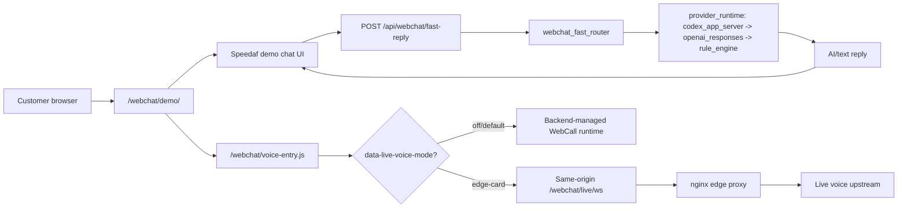
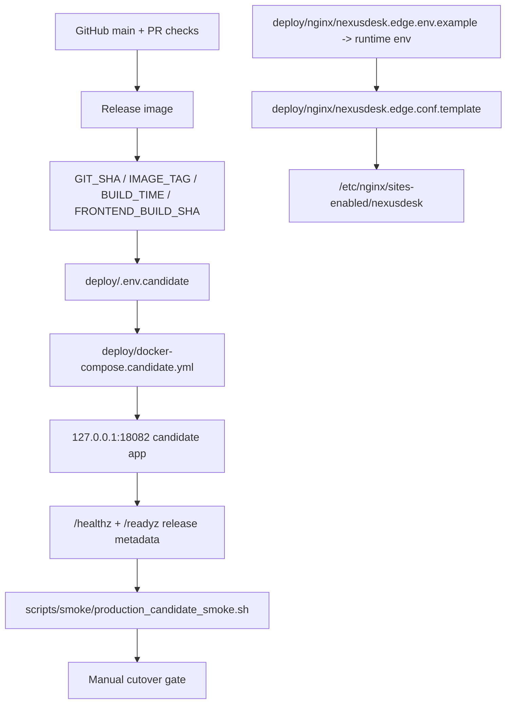
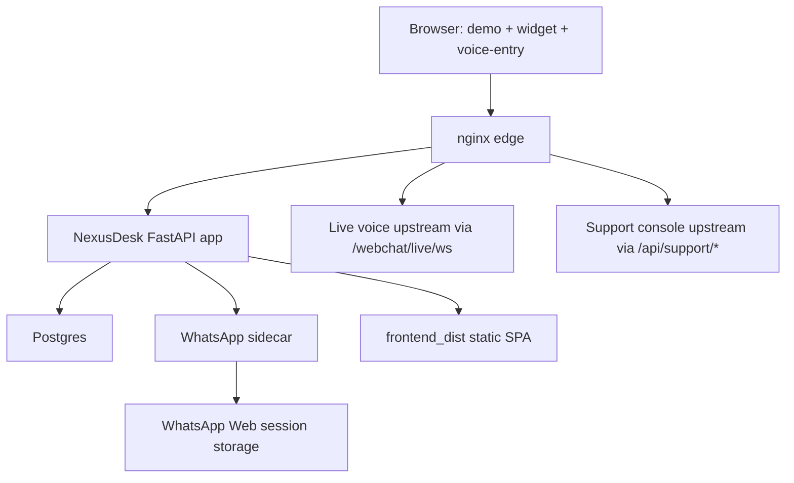

# 178 Production Drift Reconciliation

Date: 2026-06-29

Scope: reconcile GitHub `main` with observed production drift on `178.105.160.174` without deploying directly.

Evidence source: read-only production drift audit artifact collected on 2026-06-29. Raw evidence remains ignored under `backend/artifacts/`.

## Executive Status

This branch converts the production-only drift into source-controlled code, templates, tests, and runbooks. It does not switch production traffic.

Implemented here:

- Feature-gated `webchat/demo` live voice entry mode using same-origin `/webchat/live/ws`.
- Backend hotfixes for support intelligence, WhatsApp Lite session compatibility, conversation transcript evidence, login normalization, and WhatsApp broadcast-target filtering.
- Release metadata completeness fields in `/healthz` and `/readyz`.
- Secret-free nginx and compose templates.
- Candidate smoke script and controlled cutover/rollback runbook.

## Keep / Rewrite / Drop

| Area | Classification | Action |
| --- | --- | --- |
| Support intelligence API and service | Keep | Added `/api/support-intelligence/*`, backed by config DB and operation allowlist. |
| WhatsApp Lite console API | Rewrite | Keep parsing helpers and outbox mirror compatibility, but default live source is retired until a native sidecar conversation API exists. |
| Legacy support knowledge bridge endpoint | Drop | Do not retain ExternalChannel-specific support knowledge transport as a runtime dependency. |
| Legacy local media thumbnail extraction | Drop | Do not read `.external_channel/media`; media evidence should come from Nexus storage or a native provider adapter. |
| Ticket conversation transcript | Keep | Added read-only `/api/tickets/{ticket_id}/conversation-transcript`. |
| Login username normalization | Keep | Kept case-insensitive lookup and normalized throttle key. |
| WhatsApp outbound target cleanup | Keep | Dropped `status@broadcast`/`broadcast` targets before dispatch. |
| Production live voice card concept | Rewrite | Reimplemented as explicit `data-live-voice-mode="edge-card"` in `voice-entry.js`; default backend WebCall path remains intact. |
| Production nginx `/webchat/live/ws` and `/api/support/*` routes | Rewrite | Converted to `deploy/nginx/nexusdesk.edge.conf.template` plus env example; no runtime tokens in source. |
| WhatsApp sidecar compose | Rewrite | Converted to `deploy/docker-compose.whatsapp-sidecar.example.yml`; real tokens stay outside repo. |
| Candidate release path | Rewrite | Added standalone `deploy/docker-compose.candidate.yml` and read-only smoke script. |
| `review-session` auth endpoint | Drop for this branch | Do not merge production-only review login into main. If needed, design staging-only access separately. |
| Container mutations after image startup | Drop | Must be replaced by image build + release metadata + PR/Actions validation. |
| Timestamp-only static cache busting | Drop | Use deterministic release asset versioning, not server hand edits. |
| Production `voice-entry.js` auto-open behavior | Drop | No boot-time chat open; microphone starts only after user clicks Start. |
| Token-bearing nginx config in repo | Drop | Tokens/upstream credentials must be injected at render time. |
| Host-specific systemd paths | Drop for this branch | Keep host path differences in ops inventory, not app source. |
| Unreviewed frontend production drift using `sessionFields.ts` | Rewrite later | Needs a frontend-focused PR and UI/API contract tests. |

## Business Chain

## Configuration Chain

## Architecture Chain

## Difference Report

The production app was on the same Git commit as `main`, but the running container and host worktree had uncommitted drift. The most material differences were:

- Runtime metadata reported an older image/SHA than the host checkout, so `/healthz` could not prove the running release.
- `voice-entry.js` in production replaced backend WebCall with a direct live WebSocket card and auto-open behavior.
- nginx hosted production-only `/webchat/live/ws`, `/webchat/live/health`, `/api/support/*`, `/speedy-console`, and `/dsp/*` routes.
- The container had added/changed files after image start, including support intelligence and WhatsApp Lite modules.
- A WhatsApp sidecar compose file existed only on the host.

This branch keeps the operationally useful behavior but moves it into explicit, testable source artifacts. The remaining production switch must follow `docs/runbooks/production-candidate-cutover-178.md`.
