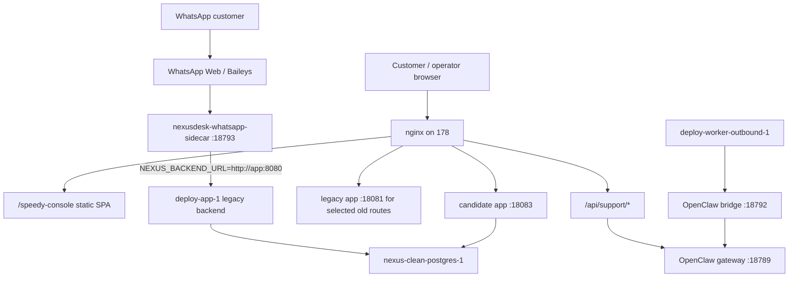
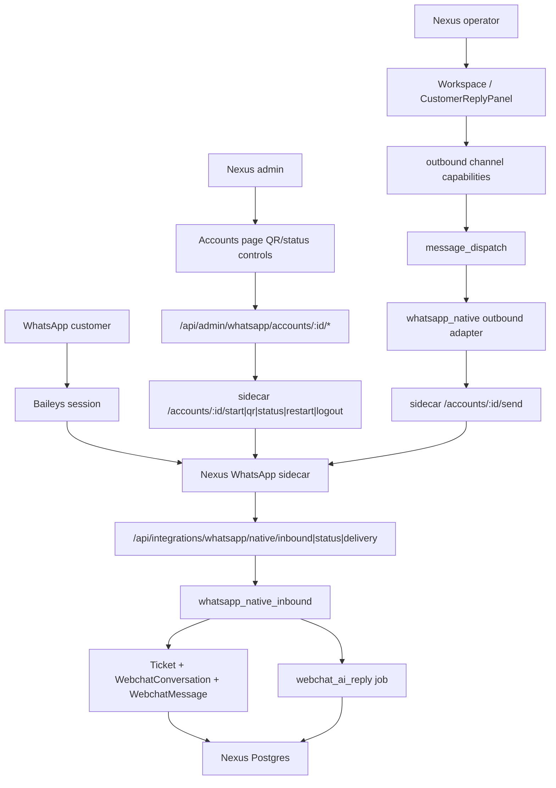
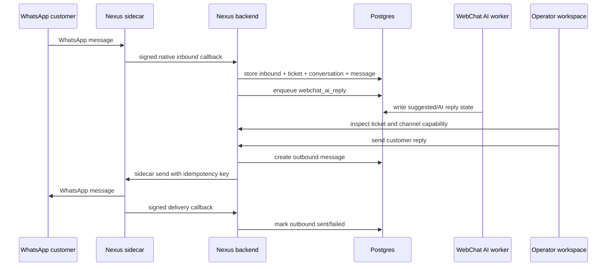
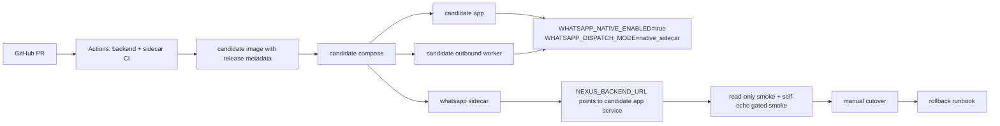

# 178 WhatsApp Channel Extraction Audit

Date: 2026-06-30

Scope: read-only audit of the WhatsApp customer channel, OpenClaw gateway, and Speedy Console on `178.105.160.174`. No server files, containers, routes, databases, or secrets were changed.

## Executive Decision

The WhatsApp customer channel can be extracted into NexusDesk, but the extraction should not embed OpenClaw runtime or Speedy Console as a dependency.

The durable capability is already mostly Nexus-shaped:

- `nexusdesk-whatsapp-sidecar` owns WhatsApp Web/Baileys session lifecycle.
- Nexus backend already has native admin, inbound, delivery, and outbound adapter code.
- Nexus operator workspace already has channel capability gates and customer reply flow.

The part that still needs rewrite is the production wiring and read model. Production currently has a split runtime: public traffic is on the candidate app, but the WhatsApp sidecar still calls the legacy `deploy-app-1` service, and legacy outbound workers still run with bridge mode.

## Observed Production Facts

| Area | Fact |
| --- | --- |
| Public app | `www.leakle.com` health reports candidate image `candidate-126ec570f3ef-20260630T082402Z`. |
| GitHub main | `origin/main` observed at `1a0f6fa2d6a0...`; production candidate is `126ec570f3ef...`. |
| Speedy Console | Static SPA under `/var/www/speedy-support-console`, exposed by nginx at `/speedy-console/`. |
| Speedy support API | nginx proxies `/api/support/conversations*` and `/api/support/knowledge/*` to local OpenClaw gateway `127.0.0.1:18789`. |
| OpenClaw gateway | Running as `openclaw gateway --port 18789`; direct support endpoints require auth. |
| Legacy bridge | OpenClaw bridge is still listening on `172.19.0.1:18792`. |
| WhatsApp sidecar | Running as `nexusdesk-whatsapp-sidecar`, image `node:22-bookworm-slim`, local port `127.0.0.1:18793`, mode `baileys`. |
| Sidecar callback target | `NEXUS_BACKEND_URL=http://app:8080`, which resolves inside `deploy_default` to legacy `deploy-app-1`, not the public candidate app. |
| Candidate WhatsApp dispatch | Candidate app has `WHATSAPP_NATIVE_ENABLED=true` but `WHATSAPP_DISPATCH_MODE=disabled`. |
| Legacy WhatsApp dispatch | `deploy-app-1` and `deploy-worker-outbound-1` still use legacy bridge dispatch mode. |
| True business DB | App containers point at `nexus-clean-postgres-1/nexusdesk`; `deploy-postgres-1` is not the active business DB. |
| DB aggregate state | Active DB has one WhatsApp channel account marked `offline`, 31 native inbound rows, 7 `whatsapp-native` conversations, and outbound history split across bridge and native statuses. |

## Current Production Topology

## Native Nexus Target Topology

## Sidecar Contract Worth Keeping

The sidecar already exposes a clean provider-neutral boundary:

| Direction | Contract |
| --- | --- |
| Admin to sidecar | `POST /accounts/:account_id/start`, `POST /logout`, `POST /restart`, `GET /status`, `GET /qr`. |
| Send to sidecar | `POST /accounts/:account_id/send` with `idempotency_key`, `target` or `chat_jid`, `body`, optional `metadata`. |
| Sidecar to backend | `POST /api/integrations/whatsapp/native/inbound`, `/status`, `/delivery`. |
| Auth | Bearer token for backend-to-sidecar; HMAC headers for sidecar-to-backend callbacks. |
| State | `ChannelAccount` stores account metadata and health; sidecar stores WhatsApp auth sessions outside Git. |
| Idempotency | Inbound unique key by account and external message id; outbound idempotency key at sidecar boundary. |

## Keep / Rewrite / Drop

| Item | Classification | Reason |
| --- | --- | --- |
| `connectors/whatsapp-sidecar` Baileys connector | Keep | It is already Nexus-owned and has a small HTTP contract. |
| HMAC callback verification | Keep | Correct boundary for an internal connector calling the backend. |
| `ChannelAccount` + WhatsApp native admin API | Keep | Needed for QR login, restart/logout, status, market routing, health. |
| `whatsapp_native_inbound` projection | Keep | It already creates ticket, webchat conversation, message, event, and AI turn. |
| `whatsapp_native` outbound adapter | Keep | It already maps Nexus outbound messages to sidecar send calls. |
| Operator reply capability gate | Keep | This is the right UI safety boundary for real customer sends. |
| Speedy Console conversation filtering UX | Rewrite | Keep the product idea, but back it with Nexus DB read models instead of OpenClaw `/api/support/*`. |
| `whatsapp_lite` read path | Rewrite | Replace bridge conversation reads with `webchat_conversations`, `whatsapp_inbound_messages`, and outbound mirror/timeline data. |
| `whatsapp_lite` send path | Rewrite | Route through `TicketOutboundMessage -> message_dispatch -> native_sidecar`, not bridge dispatch. |
| Sidecar compose | Rewrite | Template it so the sidecar can call the candidate app/worker set intentionally, not legacy `app:8080` by accident. |
| Production worker topology | Rewrite | Run one outbound worker set with `WHATSAPP_DISPATCH_MODE=native_sidecar`; stop bridge-mode duplicate workers before cutover. |
| OpenClaw gateway as support API dependency | Drop | It should not be required for Nexus WhatsApp customer channel operation. |
| OpenClaw bridge dispatch | Drop | It is already retired in source and still exists only as production drift. |
| OpenClaw env names and route names for runtime control | Drop | They preserve the wrong mental model for de-OpenClaw runtime. |
| Copying WhatsApp session files into Git or docs | Drop | Session storage is credential material and must remain server-secret state. |

## Business Chain To Preserve

## Configuration Chain To Make Explicit

## Migration Plan

1. Source control the native channel contract.
   - Add/keep tests for sidecar HTTP routes, HMAC callback verification, inbound projection, outbound adapter, and operator capability gates.
   - Use GitHub Actions as the primary validation path, especially `whatsapp-sidecar-ci` and focused backend tests.

2. Replace legacy conversation read model.
   - Implement a Nexus-native WhatsApp conversation list/detail API over `webchat_conversations`, `whatsapp_inbound_messages`, `ticket_outbound_messages`, and ticket timeline.
   - Keep the Speedy Console UX idea only as a frontend reference, not as a dependency on `/api/support/conversations`.

3. Wire candidate sidecar path without public cutover.
   - Candidate app and candidate outbound worker must both use `WHATSAPP_DISPATCH_MODE=native_sidecar`.
   - Sidecar callback target must point at the candidate app service, not legacy `deploy-app-1`.
   - Keep OpenClaw bridge disabled in the candidate path.

4. Run smoke before cutover.
   - `/healthz` and `/readyz` release metadata.
   - Sidecar `/healthz` and `/readyz`.
   - Admin QR/status endpoint through Nexus auth.
   - Inbound self-echo test using the configured test prefix.
   - One controlled outbound send only after explicit manual approval.

5. Cut over with rollback.
   - Stop or isolate bridge-mode outbound workers before enabling native send.
   - Keep the previous app/worker/sidecar compose snapshots.
   - Roll back by restoring sidecar callback target and worker dispatch mode, not by editing code on the host.

## Main Risks

- WhatsApp Web/Baileys is not the same risk profile as the official WhatsApp Cloud API. Keep it isolated behind the sidecar contract so a future Cloud API adapter can replace it.
- The current production channel account is `offline`; a QR relink or session repair is required before proving live send/receive.
- Dual runtime is dangerous: candidate public UI plus legacy sidecar callback can make operators test one app while messages land in another.
- Legacy bridge-mode workers and native-sidecar workers must not process the same outbound queue at the same time.
- Session files under `/data/whatsapp-sessions` are secret-bearing runtime state. They must not be copied into Git or audit artifacts.

## Bottom Line

Yes, the WhatsApp channel can become a Nexus customer channel. The extraction target is:

`Nexus operator UI -> Nexus channel capability gate -> Nexus outbound queue -> Nexus WhatsApp sidecar -> WhatsApp`

and

`WhatsApp -> Nexus WhatsApp sidecar -> Nexus native inbound API -> ticket/webchat/AI queue`.

OpenClaw and Speedy Console should only be used as historical evidence for what the customer-channel workflow looked like. They should not remain in the runtime dependency chain.
